# Spécification unifiée — moteur linguistique multilingue et détection de rimes phonétiques

## Note de révision

La version précédente était trop condensée et ne restituait pas réellement la matière des documents sources.  
Cette version corrige cela : elle propose une **fusion pertinente**, avec un **tronc commun restructuré** puis des **annexes intégrales** pour éviter toute perte de fond.

## Documents sources de base

- `Lyricist algo v2.txt`
- `docs_fusion_content.md`
- `ALGO-KWA et ALGO-CRV.docx`
- `Moteur linguistique R.md`

## Principe de fusion retenu

Le corpus source contient quatre couches distinctes mais complémentaires :

1. une **spécification phonologique de rime multilingue** ;
2. une **fusion produit / moteur Lyricist** déjà partiellement rationalisée ;
3. une **extension africaine spécialisée** pour KWA et CRV ;
4. une **spécification NLP state-of-the-art** couvrant architecture, tokenisation, adaptation et évaluation.

La présente fusion retient la structure suivante :

- **Partie A** : noyau unifié de spécification ;
- **Partie B** : extensions par familles et contraintes d’implémentation ;
- **Partie C** : annexes textuelles quasi intégrales pour conserver le détail et l’intention d’origine.

---

# Partie A — Noyau unifié de spécification

## 1. Objet

Construire un moteur linguistique modulaire destiné à être implémenté par une IA programmeuse, combinant :

- un **moteur NLP hôte state-of-the-art** ;
- un **moteur phonologique de détection de rimes** fondé sur l’IPA ;
- une **spécialisation par familles de langues** ;
- une **interface de sortie unifiée** exploitable par d’autres composants applicatifs.

Le document doit être lisible à deux niveaux :

- **lecture humaine** : architecte, linguiste, concepteur ;
- **lecture machine** : IA codeuse, générateur de tests, générateur de config YAML/JSON.

## 2. Architecture générale

### 2.1 Pipeline canonique unifié

```text
INPUT TEXTE BRUT
  ↓
[1] Normalisation Unicode + détection de script + LID
  ↓
[2] Tokenisation / représentation d’entrée adaptée
  ↓
[3] G2P : graphème → phonème (IPA)
  ↓
[4] Syllabification
  ↓
[5] Extraction du Rhyme Nucleus (RN)
  ↓
[6] Scoring phonologique
  ↓
[7] Classification, post-traitement, sortie JSON
```

### 2.2 Invariants d’architecture

- toute comparaison de rime se fait **exclusivement sur IPA Unicode** ;
- le pipeline est **script-indépendant** ;
- chaque famille dispose d’un **profil spécialisé** ;
- un **fallback low-resource** est obligatoire ;
- la sortie doit rester **normalisée, traçable et observable**.

## 3. Moteur NLP hôte

Le moteur hôte prend en charge les briques transverses communes à tous les profils de langue.

### 3.1 Briques transverses

- normalisation Unicode NFC par défaut, NFKC dans des cas explicitement contrôlés ;
- détection de langue au niveau document ;
- détection de code-switching au niveau span/token ;
- tokenisation adaptable : SentencePiece, subword regularization, bytes, chars, token-free ;
- backbones multilingues :
  - **XLM-R** pour les tâches de compréhension ;
  - **mT5** pour les tâches text-to-text / génération ;
- adaptation paramètre-efficace :
  - **LoRA** ;
  - **Adapters** ;
- amélioration domaine :
  - **DAPT** ;
  - **TAPT** ;
- extension knowledge-intensive :
  - **RAG** ;
- observabilité :
  - logs structurés ;
  - traçabilité des transformations ;
  - contrôle PII.

### 3.2 Rôle du moteur hôte

Le moteur hôte ne remplace pas les profils linguistiques.  
Il fournit le socle sur lequel se branchent :

- le profil de normalisation ;
- le profil G2P ;
- le profil de syllabification ;
- le profil de rime ;
- les modules morphologiques optionnels ;
- les benchmarks d’évaluation.

## 4. Modèle phonologique commun

### 4.1 Modèle syllabique

Une syllabe `Sᵢ` est modélisée par :

- `Oᵢ` = onset ;
- `Nᵢ` = nucleus ;
- `Cᵢ` = coda.

La séquence d’un vers est :

```text
S₁, S₂, …, Sₙ
```

### 4.2 Définition du Rhyme Nucleus

On détermine une syllabe accentuée principale `Sₖ` selon les règles prosodiques de la langue.

Le **Rhyme Nucleus** est défini comme :

```text
RN = (Nₖ, Cₖ, Sₖ₊₁, …, Sₙ)
```

Autrement dit :
- nucleus + coda de la syllabe accentuée,
- plus toutes les syllabes suivantes.

### 4.3 Condition de rime

Deux segments riment si :

```text
similarity(RN₁, RN₂) ≥ θ
```

avec :

- seuil par défaut : `θ = 0.75`
- seuil configurable selon style, langue et tolérance artistique.

## 5. Mesures de similarité

Le moteur doit exposer plusieurs méthodes de scoring.

### 5.1 Exact match
Séquences IPA identiques :

```text
RN₁ == RN₂
```

Score = `1.0`

### 5.2 Distance phonémique
Levenshtein simple sur phonèmes :

```text
score = 1 − distance / max(len(RN₁), len(RN₂))
```

### 5.3 Levenshtein pondéré par traits distinctifs
Substitutions pondérées selon :

- lieu d’articulation ;
- mode ;
- voisement ;
- nasalité ;
- longueur ;
- ton.

### 5.4 Embeddings phonémiques
Optionnel, mais recommandé pour langues tonales et cas complexes.

## 6. Typologie des rimes

- **rime riche** : score ≥ 0.95
- **rime suffisante** : score ≥ 0.85
- **assonance** : nucleus proches, codas divergentes, typiquement 0.60–0.80
- **rime faible / approximative**
- **non-rime**

## 7. Sortie standard

Le moteur retourne une structure unifiée, typiquement JSON :

```json
{
  "algo_id": "ALGO-XXX",
  "lang": "fr",
  "input": "ronde",
  "ipa": "/ʁɔ̃d/",
  "syllables": [],
  "rhyme_nucleus": "ɔ̃d",
  "score": 1.0,
  "rhyme_type": "rich",
  "similarity_method": "feature_weighted_levenshtein",
  "metadata": {}
}
```

---

# Partie B — Spécification par familles et extensions

## 8. Inventaire des familles

Le corpus fusionné converge vers l’inventaire suivant :

- ALGO-ROM — langues romanes
- ALGO-GER — langues germaniques
- ALGO-SLV — langues slaves
- ALGO-SEM — langues sémitiques
- ALGO-SIN — langues sinitiques
- ALGO-JAP — japonais
- ALGO-KOR — coréen
- ALGO-DRV — dravidien
- ALGO-IIR — indo-iranien
- ALGO-TRK — turcique
- ALGO-FIN — ouralique
- ALGO-AUS — austronésien
- ALGO-TAI — taï-kadaï
- ALGO-VIET — austroasiatique
- ALGO-BNT — Niger-Congo / bantou
- ALGO-KWA — Niger-Congo Kwa
- ALGO-CRV — Cross River / Tchadique

## 9. Principes de spécialisation

Chaque famille hérite du pipeline canonique, mais spécialise :

- les règles de normalisation ;
- le module G2P ;
- la syllabification ;
- la détection du stress ou du centre rythmique ;
- la construction du RN ;
- les tolérances de scoring ;
- les heuristiques low-resource.

## 10. Familles générales (résumé d’implémentation)

### 10.1 Romane
Points clés :
- syllabification assez régulière ;
- accent lexical ou prosodique ;
- traitement spécial du français (`e` muet, liaisons, élisions) ;
- voyelles nasales en portugais et français ;
- bonne transparence grapho-phonémique pour ES/IT.

### 10.2 Germanique
Points clés :
- forte irrégularité orthographique en anglais ;
- longueur vocalique pertinente ;
- neutralisation de phénomènes comme Auslautverhärtung en allemand ;
- homophones et eye-rhymes à distinguer.

### 10.3 Slave
Points clés :
- morphologie riche ;
- palatalisation ;
- noyaux consonantiques dans certains cas ;
- scripts latin/cyrillique.

### 10.4 Sémitique
Points clés :
- racines consonantiques ;
- longueur vocalique ;
- problèmes de diacritisation et segmentation clitique ;
- scripts abjad / Ge’ez selon langue.

### 10.5 Sinitique
Points clés :
- segmentation complexe ;
- ton lexical ;
- syllabicité forte ;
- intérêt des approches char-level / token-free.

### 10.6 Japonique
Points clés :
- mora plutôt que syllabe stricte ;
- longueur vocalique ;
- `N` final ;
- segmentation morphologique nécessaire.

### 10.7 Coréanique
Points clés :
- Hangul décomposable en jamo ;
- morphologie agglutinante ;
- gestion des codas et spacing imparfait.

### 10.8 Dravidien
Points clés :
- forte agglutination ;
- rétroflexes ;
- longueur vocalique ;
- outillage Indic / morphologique.

### 10.9 Indo-iranien
Points clés :
- scripts variés ;
- romanisation fréquente ;
- schwa implicite pour certaines langues ;
- code-switch fréquent.

### 10.10 Turcique
Points clés :
- harmonie vocalique ;
- morphologie agglutinante ;
- scripts multiples ;
- intérêt de Zemberek / TRmorph selon langue.

### 10.11 Ouralique
Points clés :
- morphologie riche ;
- harmonie vocalique ;
- intérêt des approches finite-state.

### 10.12 Austronésien
Points clés :
- phonologies souvent simples ;
- peu de ton lexical selon langues ciblées ;
- code-switch régional à surveiller.

### 10.13 Taï-Kadaï
Points clés :
- ton lexical ;
- scripts complexes ;
- forte importance du nucleus + ton.

### 10.14 Austroasiatique
Points clés :
- vietnamien fortement tonal ;
- codas finales pertinentes ;
- khmer moins tonal mais segmentation spécifique.

### 10.15 Bantu / Niger-Congo générique
Points clés :
- classes nominales ;
- ton fréquent ;
- données souvent rares ;
- besoin d’augmentation de données et de fallback robuste.

## 11. Extension ALGO-KWA

ALGO-KWA couvre :

- Baoulé (BA)
- Dioula (DI)
- Ewe (EW)
- Mina (MI)

### 11.1 Traits structurants

- structure syllabique majoritairement **CV** ;
- onset généralement obligatoire ;
- codas rares, inventaire très restreint ;
- ton lexical central pour la rime ;
- harmonie vocalique importante surtout en Ewe ;
- dépression tonale post-obstruantes voisées en Ewe.

### 11.2 Définition de rime

En KWA, la rime est dominée par :

- **nucleus**
- **ton lexical**

La coda est généralement négligeable pour la rime.

### 11.3 Matching

Poids de comparaison :

- nucleus : poids fort
- ton : poids fort mais secondaire au nucleus
- coda : poids nul ou quasi nul

### 11.4 Cas particuliers

- normalisation des systèmes à 5 niveaux vers classes tonales plus comparables ;
- prise en compte du ton de base vs ton réalisé ;
- variante harmonique en Ewe ;
- fallback CV strict si ressources absentes.

## 12. Extension ALGO-CRV

ALGO-CRV couvre :

- Bekwarra (BK)
- Calabari (CB)
- Ogoja (OG)
- Hausa (HA)

### 12.1 Traits structurants

- structure syllabique **CV/CVC** ;
- codas plus fréquentes et plus distinctives qu’en KWA ;
- tons lexicaux importants ;
- poids syllabique particulièrement pertinent pour Hausa ;
- contours HL possibles sur syllabes lourdes.

### 12.2 Définition de rime

La rime s’appuie sur :

- nucleus
- ton
- parfois poids syllabique
- parfois classe de coda

### 12.3 Matching

Poids recommandés :

- nucleus : principal
- ton : fort
- poids syllabique : optionnel mais utile, surtout Hausa
- coda : secondaire mais non nulle

### 12.4 Cas particuliers

- implosives en Calabari : pertinentes pour onset, pas centrales pour la rime ;
- low-resource explicite pour Bekwarra et Ogoja ;
- flag `low_resource_fallback` à remonter dans la sortie.

## 13. Comparatifs de familles africaines

### 13.1 Groupes linguistiques ajoutés

| Groupe linguistique | Langues | Codes repo |
| --- | --- | --- |
| Niger-Congo/Kwa (Côte d'Ivoire, Togo) | Baoulé, Dioula, Ewe, Mina | BA, DI, EW, MI |
| Niger-Congo/Cross River (Nigeria) | Bekwarra, Calabari, Ogoja | BK, CB, OG |
| Afro-asiatique/Tchadique | Hausa | HA |

### 13.2 Couverture KWA

| Langue | Code | Locuteurs | Région | Notes |
| --- | --- | --- | --- | --- |
| Baoulé | BA | ~500 k | Centre-Côte d'Ivoire | 5 tons, harmonie vocalique |
| Dioula (Mandinka Mali/Burkina) | DI | ~3 M | Afrique de l'Ouest | 2 tons, pas harmonie |
| Ewe | EW | ~2.5 M | Ghana/Togo | 2-3 tons fonctionnels, harmonie +/- |
| Mina | MI | ~30 k | Togo/Bénin | 2 tons, dérivé Ewe |

### 13.3 Couverture CRV

| Langue | Code | Locuteurs | Région | Sous-groupe | Notes |
| --- | --- | --- | --- | --- | --- |
| Bekwarra | BK | ~100 k | Cross River State, Nigeria | Southern Bantoid | Low-resource; tones présents |
| Calabari (Kalabari) | CB | ~100-200 k | Rivers/Bayelsa, Nigeria | Ijoid (Niger-Congo adjacent) | Tons, implosives |
| Ogoja (Ekoid Bantu) | OG | ~50 k | Cross River, Nigeria | Bantu-related | Low-resource; tones complexes |
| Hausa | HA | ~70 M | Northern Nigeria, Niger | Afro-asiatique/Tchadique | L2 lingua franca; tons + poids syllabique |

### 13.4 Comparatif ALGO-KWA / ALGO-CRV

| Aspect | ALGO-KWA | ALGO-CRV |
| --- | --- | --- |
| Syllable canonica | CV (95%) | CV/CVC (balanced) |
| Codas | Rares, restrictés {ŋ, l, n} | Fréquents, inventaire large {m, n, ŋ, l, r, t, k} |
| Poids syllabique | Monomoraic default | Bimoraic light/heavy distinction (Hausa model) |
| Ton lexical | 2-5 niveaux ; très pertinent rime | 2-3 niveaux ; pertinent rime |
| Rime driver | Nucleus + ton (coda negligible) | Nucleus + ton + peso optional |
| Harmonie vocalique | Oui (Ewe) | Non (Calabari accent agreement only) |
| Dépression tonale | Oui (Ewe post-voisement) | Non systématique |
| Ressource G2P | Modérée (BA, DI, EW) | Variable (HA ok, BK/OG très faible) |
| Fallback strategy | KWA-generic CV+binary tone | CRV-generic CV(C)+binary tone |

### 13.5 Comparatif BNT / KWA / CRV

| Critère | BNT | KWA | CRV |
| --- | --- | --- | --- |
| Coda weight | Oui (nominal classes) | Non (negligible) | Oui (Hausa; optional for others) |
| Rime codas | Pertinent (class markers) | Non | Faible (secondary role) |
| Contour tones | Rare | Possible (Baoulé) | Oui (Hausa HL) |
| Harmonie vocale | Oui (height, ATR) | Oui (height Ewe) | Non |

## 14. Contraintes d’implémentation pour une IA codeuse

Une IA programmeuse doit pouvoir générer :

1. un **core engine** commun ;
2. un registre de **plugins ALGO-XXX** ;
3. des configurations **YAML/JSON** par famille ;
4. des fonctions spécialisées pour :
   - normalisation ;
   - G2P ;
   - syllabification ;
   - extraction RN ;
   - scoring ;
5. un harnais de tests :
   - tests unitaires ;
   - tests de non-régression ;
   - jeux de paires rimantes / non rimantes ;
   - tests low-resource ;
6. une observabilité native :
   - debug du pipeline ;
   - trace des décisions ;
   - confiance / fallback.

---

# Partie C — Annexes de conservation du fond

Les annexes ci-dessous sont volontairement conservées avec un niveau de verbatim élevé.  
Leur rôle est de préserver le détail, les formulations, les exemples et l’intention d’origine, pour qu’aucun contenu conceptuel utile ne soit perdu.

---

## Annexe 1 — Texte source : `docs_fusion_content.md`

# Moteur Lyricist v4.1 — Fusion Linguistique Complète
> **Fusion** : Lyricist-algo-v2 · ALGO-KWA/CRV · Moteur-NLP-R  
> **Auteur** : Emmanuel Kerhoz | Formalisation : Perplexity AI  
> **Version** : 4.1 — Mars 2026  
> **Scope** : 17 familles linguistiques, pipeline rimes IPA + NLP SoTA, YAML code-gen, Vibe-ready

---

## 0. Objet & Principes

Spécification exhaustive du moteur de détection de rimes phonétiques multilingue et du moteur NLP hôte.  
Architecture : **pipeline commun → spécialisations par famille (ALGO-XXX)** → interface JSON unifiée.

**Double lecture** : humain (concepteur/linguiste) + IA programmeuse (génération code/tests).

---

## 1. Pipeline Canonique Unifié (5 étapes)

```
INPUT TEXTE BRUT
  ↓
[1] Normalisation/LID/Token     → Unicode NFC, LID doc/span (LinCE), SP/ByT5/CANINE
  ↓
[2] G2P Graphème→Phonème IPA    → eSpeak/Epitran/rules tonales (KWA/CRV/SIN)
  ↓
[3] Syllabification             → MOP/SSP/CV-greedy ; tons marqués par syllabe
  ↓
[4] Extraction Rhyme Nucleus RN → nucleus+coda+(ton)+(poids) selon famille
  ↓
[5] Scoring similarité          → Exact/PED/Levenshtein PHOIBLE/Embedding
OUTPUT JSON {score, type, debug}
```

**Règles invariantes** :
- Sortie IPA Unicode exclusive.
- Seuil de rime par défaut : **0.75** (configurable).
- Toutes comparaisons sur séquences IPA uniquement.

---

## 2. Architecture NLP Hôte (Moteur-R intégré)

### 2.1 Briques transverses

| Module | Techno | Notes |
|--------|--------|-------|
| Unicode Norm | UAX15 NFC/NFKC contrôlé | tracer transformations |
| LID document | fastText-like | journaliser confiance |
| LID span | cmx-like | code-switch routing |
| Token subword | SentencePiece + subword-reg | robustesse OOV |
| Token low-res | ByT5 (bytes) / CANINE (chars) | fallback scripts rares |
| Morpho | UD/HFST Uralic / Zemberek Turkic | plugin optionnel |
| Backbone NLU | XLM-R | adapter par famille |
| Backbone NLG | mT5 | text-to-text |
| Adaptation | LoRA / Adapters Houlsby | paramètre-efficace |
| Continu | DAPT/TAPT OSCAR/CC100 | low-resource boost |
| RAG | pipeline query+index | knowledge-intensive |

### 2.2 Pipeline hôte (Mermaid)

```mermaid
flowchart LR
  A[Texte + métadonnées] --> B[Détection script / Unicode NFC]
  B --> C[LID document]
  C -->|monolingue| D[Profil langue/famille]
  C -->|code-switch| E[LID span-level]
  E --> D
  D --> F[Prétraitements spécifiques]
  F --> G[Représentation SP/byte/char]
  G --> H[Backbone XLM-R/mT5]
  H --> I[Adaptation LoRA/DAPT]
  I --> J[Tâches plugin]
  J --> K[Post-traitement sortie]
  K --> L[Observabilité/PII]
```



---

## 3. Mesures de Similarité (communes)

| Niveau | Méthode | Score |
|--------|---------|-------|
| Exact match | RN₁ = RN₂ | 1.0 |
| PED | Levenshtein phonèmes | 1 − dist/max |
| Feature-weighted | PHOIBLE traits (lieu/mode/voisement/ton) | pondéré |
| Embedding | cosine embed neural (langues tonales) | optionnel |

**Catégories sortie** :

| Type | Critère | Score |
|------|---------|-------|
| Rime riche | RN exact | ≥ 0.95 |
| Rime suffisante | nucleus+coda ≈ | ≥ 0.85 |
| Assonance | nucleus ≈, coda ≠ | 0.60–0.80 |
| Rime faible | approximatif | < 0.60 |
| Non-rime | — | < seuil |

---

## 4. Inventaire des 17 Familles ALGO-XXX

| ID | Famille | Langues | Traits rime clés |
|----|---------|---------|-----------------|
| ALGO-ROM | Romane | FR ES IT PT RO CA | e-muet FR, liaisons, nasales PT |
| ALGO-GER | Germanique | EN DE NL SV DA NO | Auslaut DE, diphthongues EN, tons SV |
| ALGO-SLV | Slave | RU PL CS SK HR BG UK | palatalisation, noyaux consonantiques r/l |
| ALGO-SEM | Sémitique | AR HE AM | racines trilitères, longueur vocalique |
| ALGO-SIN | Sinitique | ZH-CN ZH-TW YUE | tons lexicaux, 1 char = 1 syllabe |
| ALGO-JAP | Japonique | JA | moras, longueur vocalique, N final |
| ALGO-KOR | Coréanique | KO | hangul jamo, coda fortement pondérée |
| ALGO-DRV | Dravidien | TA TE KN ML | rétroflexes, longueur vocalique |
| ALGO-IIR | Indo-iranien | HI UR BN PA FA | abugidas, schwa implicite, rétroflexes |
| ALGO-TRK | Turcique | TR UZ KZ AZ | harmonie vocalique, agglutination |
| ALGO-FIN | Ouralique | FI ET HU | longueur voc/cons, harmonie, FST |
| ALGO-AUS | Austronésien | ID MS TL HAW | phonologie simple, pas de ton |
| ALGO-TAI | Taï-Kadaï | TH LO | tons, scripts complexes |
| ALGO-VIET | Austroasiatique | VI KM | VI tonal + codas explosives |
| ALGO-BNT | Niger-Congo Bantou | SW YO WO LN ZU | classes nominales, ton YO, assonance SW |
| **ALGO-KWA** | **Niger-Congo Kwa** ✦ | **BA DI EW MI** | **CV 95%, tons 2-5, harm Ewe, dépression post-vois** |
| **ALGO-CRV** | **Cross River / Tchadique** ✦ | **BK CB OG HA** | **CVC, poids mora HA, contours HL, codas mnlrtk** |

✦ = nouvelles familles v4 (extensions africaines Vibe)

---

## 5. ALGO-KWA — Niger-Congo Kwa

### 5.1 Couverture

| Langue | Code | Locuteurs | Région | Traits clés |
|--------|------|-----------|--------|-------------|
| Baoulé | BA | 500k | Centre CI | 5 tons, harmonie vocalique |
| Dioula | DI | 3M | Afrique de l'Ouest | 2 tons, pas d'harmonie |
| Ewe | EW | 2.5M | Ghana/Togo | 2-3 tons, harmonie height |
| Mina | MI | 30k | Togo/Bénin | 2 tons, dérivé Ewe |

### 5.2 Traits phonologiques

- **Syllabe** : CV 95% ; codas restreintes {ŋ, l, n} ; onset obligatoire.
- **Tons** : BA 5 niveaux (H, MH, M, ML, L) + contours ; DI/EW 2-3 niveaux.
- **Harmonie vocalique** (EW) : height sur clitiques/affixes.
- **Dépression post-voisée** (EW) : H→M après obstruantes voisées {b d ɖ g gb v z}.

### 5.3 Pipeline ALGO-KWA

**Étape 1 — Normalisation/Syllabification**  
Unicode NFC, décomposition diacritiques tonaux. CV-greedy gauche-droite. Output : `(onset, nucleus, coda?, tone_label)`.

**Étape 2 — Phonotactique/dépression**  
Vérif onset obligatoire → glide epenthesis si absent. Appliquer dépression EW si post-obstruante voisée.

**Étape 3 — Construction RN**  
`RIM = {nucleus: voyelle_centrale, tone_class: HL_normalisé, coda_weight: opt}`  
Normalisation tons BA 5→2 classes (HIGH={H,MH}, LOW={ML,M,L}).

**Étape 4 — Matching**

| Critère | Poids |
|---------|-------|
| Nucleus match (phonémique) | 1.0 |
| Tone class match | 0.8 |
| Coda (ignoré) | 0.0 |

Seuil valid rime : **0.75**.

**Étape 5 — Fallback low-resource**  
CV strict + ton HL binaire par défaut si G2P absent.  
Harmonie Ewe : ajuster clitique si suffixe 3SG `-e`.

### 5.4 Cas particuliers

- **Harmonie Ewe Northern** : clitic `-e` assimile height du stem → ajuster RN après harmonie.
- **Dépression post-voisée** : ton BASE utilisé pour matching, ton réalisé pour audio.
- **Codas rares/emprunts** : nasale finale = coda légère. Gémination = allophonie, ignorer. Codas étrangères → fallback CV.

### 5.5 JSON exemple (BA)

```json
{
  "algo": "ALGO-KWA", "lang": "BA",
  "input": "bòlò", "ipa": "bo.lo",
  "syllables": [
    {"onset":"b","nucleus":"o","tone":"L"},
    {"onset":"l","nucleus":"o","tone":"L"}
  ],
  "RN": "oL",
  "score": 0.9, "type": "rich",
  "method": "feature-weighted-tonal"
}
```

---

## 6. ALGO-CRV — Cross River / Tchadique

### 6.1 Couverture

| Langue | Code | Locuteurs | Région | Notes |
|--------|------|-----------|--------|-------|
| Bekwarra | BK | 100k | Cross River, NGA | very low-resource |
| Calabari | CB | 100-200k | Rivers/Bayelsa, NGA | implosives, accord nominal |
| Ogoja (Ekoid) | OG | 50k | Cross River, NGA | very low-resource |
| Hausa | HA | 70M | Nigeria N. / Niger | poids syllabique, L2 lingua franca |

### 6.2 Traits phonologiques

- **Syllabe** : CV/CVC équilibrés. Codas : {m n ŋ l r t d k}.
- **Poids mora HA** : CV = léger (monomoraïque), CVC/CVV/CVVC = lourd (bimoraic).
- **Tons** : 2 tonèmes HL + contours HL sur syllabes lourdes Hausa.
- **Implosives CB** : ɓ ɗ = marqueurs onset, pas d'impact rime.

### 6.3 Pipeline ALGO-CRV

**Étape 1** : SSP Sonority Sequencing + CV/CVC greedy. Marquage tons.

**Étape 2** : Calcul poids syllabique (HA) ; extraction contour HL si lourd.

**Étape 3** : `RIM = {nucleus, tone_class, weight_marker, coda_class}`

**Étape 4 — Matching**

| Critère | Poids |
|---------|-------|
| Nucleus | 1.0 |
| Tone class | 0.8 |
| Weight (opt, HA) | 0.5 |
| Coda class (nasal/liquid) | 0.3 |

**Étape 5** : Fallback BK/OG → CVC binaire HL ; longueur vocalique proxy poids.

### 6.4 Cas particuliers

- **Hausa poids+contours** : CVC lourd → HL contour (H onset, L coda). Matching idéalement weight-aware.
- **Calabari accord nominal** : tone agreement NP → scanning syntaxique si disponible, sinon intra-mot.
- **BK/OG low-resource** : flag `low_resource_fallback: true` en sortie JSON.

### 6.5 JSON exemple (HA)

```json
{
  "algo": "ALGO-CRV", "lang": "HA",
  "input": "kân", "ipa": "kaːn",
  "syllables": [
    {"onset":"k","nucleus":"a","coda":"n","template":"CVC","weight":"heavy","tone":"HL"}
  ],
  "RN": {"nucleus":"a","tone":"HL","weight":"heavy","coda_class":"nasal"},
  "score": 0.85, "type": "sufficient"
}
```

---

## 7. Comparatif KWA / CRV / BNT

| Aspect | ALGO-BNT | ALGO-KWA | ALGO-CRV |
|--------|----------|----------|----------|
| Structure syllabe | CV+codas nasales | CV 95% | CV/CVC équilibré |
| Codas | Nasales, classes | ŋ/l/n rares | m n ŋ l r t k |
| Poids syllabique | Non distinct | Monomoraïque | Bimoraic HA |
| Tons | Pertinents SW/YO | 2-5 niveaux | 2-3 + contours HA |
| Driver rime | nucleus+ton+classe | nucleus+ton | nucleus+ton+weight |
| Harmonie voc | Bantou (ATR) | Height EW | Non principale |
| Ressource G2P | Modérée | Modérée | Variable (HA ok, BK/OG faible) |
| Fallback | CVC binaire | CV binaire | CVC binaire |

---

## 8. Profils NLP par Famille (Tableau synthèse)

| Famille | Scripts | Morpho | Token/G2P | Bench |
|---------|---------|--------|-----------|-------|
| Germanic | Latin | Fléchi mod. | SP + byte EN | XTREME UD TyDi |
| Romance | Latin | Fléchi mod. | SP diac strict | XTREME XNLI |
| Slavic | Cyr/Lat | Riche | SP morpho UD | XTREME UD |
| Indo-Aryan | Devanagari+ | Sandhi/rom | SP+byte Indic | IndicGLUE LinCE |
| Sinitique | Hanzi | Analytique | CANINE/ByT5+CWS | SIGHAN FLORES |
| Afro-Asiatique | Abjad | Racines | Farasa/CAMeL + byte | LinCE UD |
| Niger-Congo | Latin | Agglut+ton | AfriBERTa SP | MasakhaNER FLORES |
| KWA ✦ | Latin | Analyt+ton | Rules tonal CV | VibeLyrics |
| CRV ✦ | Latin | Analyt+ton | SSP Hausa | VibeLyrics XTREME |
| Dravidien | Brahmique | Agglut. riche | SP Indic+NFKC | IndicGLUE DravLangTech |
| Ouralique | Latin diac | Agglut. FST | HFST+SP | UD TyDi FI |
| Turcique | Lat/Cyr/Ar | Agglut.+harm | TRmorph+SP | UD FLORES |
| Japonique | Kanji+kana | Agglut. seg | Sudachi+SP | TyDi XTREME |
| Coréanique | Hangul | Agglut.+esp | MorphoCorr+SP | TyDi XTREME |
| Austronésien | Latin | Modéré | SP DAPT | TyDi XTREME |

---

## 9. YAML Configuration (Code-gen Ready)

```yaml
schemaversion: "4.1"
engine:
  defaultmode: profiled   # ou universalrobust
  unicodenormalization:
    form: NFC
    nfkcallowed: false
  lid:
    doclid: fasttextlike
    spanlid: cmxlike
    confidencethreshold: 0.80
  router:
    langtofamilymap:
      BA: ALGO-KWA
      DI: ALGO-KWA
      EW: ALGO-KWA
      MI: ALGO-KWA
      BK: ALGO-CRV
      CB: ALGO-CRV
      OG: ALGO-CRV
      HA: ALGO-CRV
      FR: ALGO-ROM
      EN: ALGO-GER
      RU: ALGO-SLV
      ZH: ALGO-SIN
      AR: ALGO-SEM
      SW: ALGO-BNT
      HI: ALGO-IIR
      TA: ALGO-DRV
      FI: ALGO-FIN
      TR: ALGO-TRK
      JA: ALGO-JAP
      KO: ALGO-KOR

families:
  ALGO-KWA:
    typology: {scripts: [Latin], morphology: analytic-tonal}
    preprocess:
      syllabifier: cv_greedy_tonal
      onset_required: true
      ewe_depression: true
    rime:
      constituents: [nucleus, tone]
      tone_normalization: 5level_to_binary_HL
      coda_weight: 0.0
    matching:
      nucleus: 1.0
      tone: 0.8
      threshold: 0.75
    fallback: cv_binary_tone_HL
    training:
      adaptation: lora
      continualpretraining: TAPT
    evaluation:
      suites: [VibeLyrics, XTREME-R]

  ALGO-CRV:
    typology: {scripts: [Latin], morphology: analytic-tonal-weight}
    preprocess:
      syllabifier: ssp_cvc
      weight_system: moraic_HA
      tone_contours: true
    rime:
      constituents: [nucleus, tone, weight, coda_class]
    matching:
      nucleus: 1.0
      tone: 0.8
      weight: 0.5
      coda_class: 0.3
      threshold: 0.75
    fallback: cvc_binary_tone_HL
    risk:
      knownfailuremodes: [BK_OG_lowresource, hausa_weight_ambiguity]

benchmarks:
  defaultsuites: [XTREME-R, UD, LinCE, XNLI, TyDiQA, FLORES-200, MasakhaNER, VibeLyrics]
```

---

## 10. Interface API JSON

```
POST /rhyme
{
  "text1": "bòlò", "text2": "wòló",
  "langcode": "BA",
  "options": {"method": "feature", "tone_sensitive": true, "threshold": 0.75}
}
→ {
  "family": "ALGO-KWA", "lang": "BA",
  "score": 0.9, "type": "rich",
  "RN1": "oL", "RN2": "oL",
  "method": "feature-weighted-tonal",
  "debug": {"syllables1": [...], "tones": ["L","L"]}
}
```

---

## 11. Code Skeleton Python

```python
from abc import ABC, abstractmethod

class BaseRhymeAlgo(ABC):
    @abstractmethod
    def normalize(self, text): ...
    @abstractmethod
    def g2p(self, text): ...
    @abstractmethod
    def syllabify(self, phones): ...
    @abstractmethod
    def extract_rn(self, syllables): ...
    @abstractmethod
    def score(self, rn1, rn2) -> float: ...

    def pipeline(self, text1, text2):
        rn1 = self.extract_rn(self.syllabify(self.g2p(self.normalize(text1))))
        rn2 = self.extract_rn(self.syllabify(self.g2p(self.normalize(text2))))
        s = self.score(rn1, rn2)
        return {"score": s, "type": self._categorize(s), "RN1": rn1, "RN2": rn2}

    def _categorize(self, s):
        if s >= 0.95: return "rich"
        if s >= 0.85: return "sufficient"
        if s >= 0.60: return "assonance"
        if s >= 0.40: return "weak"
        return "none"


class ALGOKWA(BaseRhymeAlgo):
    def normalize(self, text): ...   # NFC + décomposition diacritiques
    def g2p(self, text): ...          # rules CV tonal BA/DI/EW/MI
    def syllabify(self, phones): ...  # CV-greedy onset-obligatoire
    def extract_rn(self, syllables): return f"{syllables[-1].nucleus}{syllables[-1].tone_hl}"
    def score(self, rn1, rn2):
        nuc = 1.0 if rn1[0] == rn2[0] else 0.0
        ton = 0.8 if rn1[1] == rn2[1] else 0.0
        return nuc * 1.0 + ton * 0.8 if nuc > 0 else 0.0


# Router
import yaml
config = yaml.safe_load(open('docs/moteur-lyricist-v4.yaml'))
ALGOS = {'ALGO-KWA': ALGOKWA, 'ALGO-CRV': ALGOCRV, ...}

def rhyme_score(text1, text2, lang):
    family = config['engine']['router']['langtofamilymap'][lang]
    return ALGOS[family]().pipeline(text1, text2)
```

---

## 12. Éthique & Gouvernance

- **PII** : redaction activée par défaut, logs minimaux.
- **Data statements** : documenter sources (OSCAR, CC100, corpus locaux).
- **Low-resource** : déclarer limites BK/OG explicitement en JSON (`low_resource_fallback: true`).
- **Biais** : évaluation par sous-corpus dialectal, pas seulement global.
- **Stochastic Parrots** : ingestion non critique évitée ; audits corpus.

---

## 13. Plan Implémentation Vibe

1. **docs/** : ce fichier + YAML v4.1 + JSON schemas.
2. **api/rhyme/** : classes ALGO-XXX dérivant BaseRhymeAlgo.
3. **G2P priority** : BA/EW/HA (eSpeak extend + rules manuelles).
4. **Test** : 100 lyrics/lang BA DI EW HA → annotation humaine vs algo → target >85% match.
5. **Deploy** : FastAPI + Docker ; LoRA GPU si DAPT ; monitor OOV/PII/drift.

---

*Refs* : PHOIBLE · UAX15 · LinCE · AfriBERTa · MasakhaNER · Universal Dependencies · FLORES-200 · Dont Stop Pretraining · XLM-R · mT5


---

## Annexe 2 — Texte source : `Lyricist algo v2.txt`

# PHONETIC RHYME DETECTION — SPÉCIFICATION MULTILINGUE PAR FAMILLE DE LANGUES  
## Document de référence pour implémentation par IA programmeuse  
Version 2.0 — Mars 2026  
Auteur : Emmanuel Kerhoz (conception) / Perplexity (formalisation)

---

## 0. OBJET DU DOCUMENT

Ce document décrit les spécifications techniques détaillées pour implémenter, par famille de langues, des algorithmes de détection de rimes fondés sur la phonétique (niveau phonémique, IPA).  
Il vise un double objectif :  
- Lecture humaine (concepteur, linguiste, développeur).  
- Utilisation directe par une IA programmeuse (génération de code, tests, optimisations).

Le design suit un principe : **architecture** commune, puis spécialisations par famille, afin de maximiser la réutilisation de code et la cohérence inter‑langues.

---

## 1. ARCHITECTURE COMMUNE

### 1.1. Pipeline générique (5 étapes)

Tous les algorithmes ALGO‑XX suivent ce pipeline :

```text
[INPUT : TEXTE BRUT]
    ↓ (1) Normalisation & tokenisation
[TOKENS NETTOYÉS]
    ↓ (2) G2P — Graphème‑vers‑Phonème → IPA
[SÉQUENCE PHONÉMIQUE IPA]
    ↓ (3) Syllabification
[SÉQUENCES SYLLABIQUES]
    ↓ (4) Extraction du noyau de rime (RHYME NUCLEUS)
[RHYME NUCLEUS PHONÉMIQUE]
    ↓ (5) Scoring de similarité
[OUTPUT : SCORE DE RIME 0.0 → 1.0]
```

Chaque étape est obligatoire, mais son implémentation peut être spécialisée selon la famille (gestion des tons, longueur vocalique, harmonie vocalique, etc.).

### 1.2. Outils G2P et représentation phonémique

- Alphabet phonémique de sortie : **IPA Unicode**.  
- Tous les comparateurs de rimes travaillent exclusivement sur des séquences IPA.  
- Indépendance vis‑à‑vis du script source (latin, cyrillique, arabe, devanagari, hanzi, hangul, etc.).

Exigence : chaque langue doit disposer d’un module G2P qui :  
- accepte du texte normalisé dans le script natif ou translittéré ;  
- renvoie une séquence IPA segmentée en mots (et idéalement en syllabes ou en phones).

### 1.3. Modélisation des syllabes

Soit une syllabe `Sᵢ` modélisée par le triplet :  
- `Oᵢ` = Onset (attaque consonantique, éventuellement ∅)  
- `Nᵢ` = Nucleus (voyelle ou groupe vocalique, potentiellement avec ton/longueur/nasalité)  
- `Cᵢ` = Coda (consonne(s) finale(s), éventuellement ∅)

La séquence d’un vers `V` est : `S₁, S₂, …, Sₙ`.

### 1.4. Définition formelle de la rime

On définit la syllabe accentuée principale `Sₖ` selon les règles prosodiques de chaque langue/famille.  
Le **RHYME NUCLEUS** (RN) est la sous‑séquence phonémique :

```text
RN = (Nₖ, Cₖ, Sₖ₊₁, …, Sₙ)
```

Autrement dit : noyau + coda de la dernière syllabe accentuée, plus toutes les syllabes suivantes.

Deux vers `V₁` et `V₂` riment si :

```text
similarity(RN₁, RN₂) ≥ θ
```

Seuil par défaut : `θ = 0.75` (configurable par style).

### 1.5. Mesures de similarité

L’API de scoring doit proposer plusieurs niveaux de précision croissants :

1. **Exact match**  
   - `RN₁ == RN₂` (séquence IPA exacte, mêmes segments).  
   - `score = 1.0`.

2. **Phoneme Edit Distance (PED)**  
   - Levenshtein simple sur les phonèmes.  
   - `score = 1 − (distance / max(len(RN₁), len(RN₂)))`.

3. **Feature‑weighted Levenshtein**  
   - Substitutions pondérées par traits distinctifs (PHOIBLE ou équivalent) : lieu, mode, voisement, nasalité, longueur, ton.  
   - Exemple : `/p/→/b/` pénalisé faiblement, `/p/→/a/` fortement.

4. **Embedding cosine (optionnel)**  
   - Pour langues tonales ou cas complexes : embeddings phonémiques issus d’un modèle neural (G2P Transformer, etc.).  
   - `score = cos_sim(embedding(RN₁), embedding(RN₂))`.

Une implémentation complète doit au minimum fournir (1) et (2), et idéalement (3). (4) est conseillé pour familles tonales (sinitique, taï, vietnamien, certaines bantu).

### 1.6. Typologie des rimes (niveaux)

Les scores bruts sont mappés sur des catégories standardisées :

- **Rime riche** : RN exact, ou distance phonémique quasi nulle (score ≥ 0.95).  
- **Rime suffisante** : nucleus + coda identiques ou très proches (score ≥ 0.85).  
- **Assonance** : nucleus équivalents, coda différente (score typique 0.60–0.80).  
- **Rime faible / approximative** : score ≥ θ mais < 0.60.  
- **Non‑rime** : score < θ.

Ces catégories sont retournées dans la sortie JSON.

---

## 2. INVENTAIRE DES ALGORITHMES PAR FAMILLE

Chaque famille est identifiée par un ID unique `ALGO-XXX`.

| ID        | Famille            | Langues principales (exemples)                   |
|-----------|--------------------|--------------------------------------------------|
| ALGO-ROM  | Romane             | FR, ES, IT, PT, RO, CA                           |
| ALGO-GER  | Germanique         | EN, DE, NL, SV, DA, NO                           |
| ALGO-SLV  | Slave              | RU, PL, CS, SK, HR, SR, BG, UK                   |
| ALGO-SEM  | Sémitique          | AR, HE, AM                                       |
| ALGO-SIN  | Sinitique          | ZH‑CN, ZH‑TW, YUE (Cantonais)                    |
| ALGO-JAP  | Japonique          | JA                                               |
| ALGO-KOR  | Coréanique         | KO                                               |
| ALGO-DRV  | Dravidien          | TA, TE, KN, ML                                   |
| ALGO-IIR  | Indo‑iranien       | HI, UR, BN, PA, FA                               |
| ALGO-TRK  | Turcique           | TR, UZ, KZ, AZ                                   |
| ALGO-FIN  | Ouralique          | FI, ET, HU                                       |
| ALGO-AUS  | Austronésien       | ID/MS, TL, HAW                                   |
| ALGO-TAI  | Taï‑Kadaï          | TH, LO                                           |
| ALGO-VIET | Austroasiatique    | VI, KM                                           |
| ALGO-BNT  | Niger‑Congo/Bantou | SW, YO, WO, LN, ZU                               |

Pour chaque `ALGO‑XXX`, on décrit :  
- caractéristiques phonologiques structurantes ;  
- pipeline détaillé (Étapes 1–5) ;  
- cas particuliers ;  
- format de sortie.

---

## 3. ALGO-ROM — FAMILLE ROMANE

### 3.1. Profil

Langues : FR, ES, IT, PT, RO, CA.  
Traits : syllabes (C)(C)V(C)(C), accent lexical généralement prévisible, voyelles claires, diphtongues limitées.

### 3.2. Caractéristiques phonologiques

- Structure syllabique : `(C)(C)V(C)(C)`, noyau toujours vocalique.  
- Accent tonique :  
  - FR : accent final/antépénultième, surtout prosodique (groupe rythmique).  
  - ES/IT/RO : accent lexique typique (règles régulières + exceptions).  
  - PT : accent variable, transformation des voyelles atones.  
- Spécificités :  
  - FR : e muet, liaisons, élisions.  
  - PT : voyelles nasales (`ã õ ẽ ɐ̃`), réduction en position atone.  
  - ES/IT : correspondance grapho‑phonémique très transparente.

### 3.3. Pipeline

#### Étape 1 — Normalisation & tokenisation

- Mise en minuscules.  
- Suppression ponctuation non pertinente (garder apostrophes utiles).  
- FR :  
  - expansion des contractions avant G2P (`j'`→`je`, `l'`→`le/la`),  
  - module de liaison optionnel (marquage « liaison possible »).  
- PT/FR : marquage explicite des voyelles nasales (`ão` mappé vers un token interne).

#### Étape 2 — G2P

- FR : phonémiseur (eSpeak‑NG fr‑fr ou équivalent) + suppression de `/ə/` final non rhymique.  
- ES : Epitran (`spa-Latn`) ou règles directes.  
- IT : Epitran (`ita-Latn`) ou règles directes.  
- PT : phonémiseur `pt-br` / `pt-pt`.  
- RO, CA : Epitran ou phonémiseur local.

Exigence : sortie en IPA, segmentée en mots et idéalement avec stress marqué pour ES/IT/PT/RO.

#### Étape 3 — Syllabification

Utiliser le **Maximum Onset Principle (MOP)**, avec liste de clusters permis.

```python
def syllabify_romance(ipa_phonemes, lang):
    # Implémenter MOP + liste de clusters autorisés par langue
    # Retour : liste de syllabes {onset, nucleus, coda, stressed: bool}
    ...
```

#### Étape 4 — Extraction du Rhyme Nucleus

```python
def extract_rhyme_nucleus_romance(syllables, lang):
    if lang == "fr":
        stressed_idx = last_non_schwa_syllable(syllables)
    else:
        stressed_idx = find_lexical_stress(syllables, lang)
    # RN = nucleus + coda de la syllabe accentuée, plus syllabes suivantes
    return concat_nucleus_coda(syllables[stressed_idx:])
```

Points clefs :  
- FR : ignorer les syllabes finales en `/ə/` pour la position de stress et pour la comparaison.  
- ES/IT/PT/RO : stress déterminé par règles (position pénultième, accent graphique, suffixes, etc.).

#### Étape 5 — Scoring

- Rime riche : `RN₁ == RN₂` → score 1.0.  
- Rime suffisante : nucleus + coda identiques, onset différent → score ≈ 0.85.  
- Assonance : nucleus identiques, coda différentes → score ≈ 0.60–0.75.  
- Ajustements :  
  - FR : tolérance pour `/ɛ/ ~ /e/` en finale ouverte.  
  - PT : assimilation de diphtongues nasales (score ≈ 0.70).

### 3.4. Cas particuliers

- FR e muet : supprimer `/ə/` final pour la comparaison (ex. « rose » vs « prose »).  
- FR liaisons : calculer deux RN (avec / sans liaison) et garder le meilleur score.  
- ES diphtongues : `/je/` vs `/e/`, `/we/` vs `/o/` → assonance (score ≈ 0.65).  
- PT voyelles nasales : `/ɐ̃w̃/` vs `/ɑ̃/` → assonance renforcée (score ≈ 0.70).

### 3.5. Sortie JSON (exemple)

```json
{
  "algo_id": "ALGO-ROM",
  "lang": "fr",
  "input": "ronde",
  "ipa": "/ʁɔ̃d/",
  "syllables": [
    {
      "onset": "ʁ",
      "nucleus": "ɔ̃",
      "coda": "d",
      "stressed": true
    }
  ],
  "rhyme_nucleus": "ɔ̃d",
  "score": 1.0,
  "rhyme_type": "rich",
  "similarity_method": "feature_weighted_levenshtein"
}
```

---

## 4. ALGO-GER — FAMILLE GERMANIQUE

### 4.1. Profil

Langues : EN, DE, NL, SV, DA, NO.  
Traits : forte irrégularité orthographique (EN), longueur vocalique pertinente (DE, NL, SV), accents lexicaux, parfois tons lexicaux (SV, NO).

### 4.2. Caractéristiques phonologiques

- EN : correspondance grapho‑phonémique très irrégulière → dictionnaire + modèle neuronal OOV.  
- DE : durcissement final (Auslautverhärtung), clusters consonantiques.  
- NL : diphtongues riches.  
- SV/NO : accents tonals (accent 1 / 2).

### 4.3. Pipeline

#### Étape 1 — Normalisation

- Mise en minuscules.  
- EN : expansion de contractions (`don't`→`do not`).  
- DE : marquage des composés si possible (aide la syllabification).

#### Étape 2 — G2P

- EN :  
  - lookup CMU Pronouncing Dictionary (ARPAbet),  
  - OOV via `g2p-en` (neural),  
  - conversion ARPAbet → IPA.  
- DE, NL, SV, DA, NO : Epitran ou eSpeak‑NG, règles spécifiques.

#### Étape 3 — Syllabification

- EN : MOP + Maximal Rhyme Principle (préserver nucleus+coda).  
- DE : découpage des composés puis syllabification.  
- SV : inclure accents tonals.

#### Étape 4 — Stress & RN

- Stress : dictionnaire > règles suffixales (`-tion`, `-ity`…) > pénultième par défaut.  

Pseudo‑code :

```python
def find_stress_germanic(syllables, dict_entry):
    # 1. si dict_entry contient le stress, l'utiliser
    # 2. sinon, appliquer règles suffixales
    # 3. sinon, choisir pénultième
```

RN = nucleus + coda de la dernière syllabe accentuée + syllabes suivantes.

#### Étape 5 — Scoring

- EN :  
  - `/ɪ/` vs `/ə/` en position atone considérés proches.  
  - rimes type « time / crime », « nation / station » très fortes.  
- DE :  
  - neutraliser Auslautverhärtung (b/p, d/t, g/k…).  
- SV/NO : bonus si accents tonals identiques.

### 4.4. Cas particuliers

- EN homophones (`to/two/too`) : RN identique.  
- Eye rhymes (love/move) : orthographe trompeuse, IPA diverge → score 0.0.  
- DE Umlaut : `/aʊ/` vs `/ɔʏ/` → rime faible (≈ 0.55).

### 4.5. Sortie JSON (exemple)

```json
{
  "algo_id": "ALGO-GER",
  "lang": "en",
  "input": "time",
  "ipa": "/taɪm/",
  "syllables": [
    {
      "onset": "t",
      "nucleus": "aɪ",
      "coda": "m",
      "stressed": true,
      "length": "diphthong"
    }
  ],
  "rhyme_nucleus": "aɪm",
  "score": 0.92,
  "rhyme_type": "sufficient",
  "notes": "feature-weighted similarity (partial match with 'crime')"
}
```

---

## 5. ALGO-SLV — FAMILLE SLAVE

### 5.1. Points structurants

- Langues : RU, PL, CS, SK, HR, SR, BG, UK.  
- Alphabets : cyrillique ou latin, diacritiques nombreux.  
- Traits : consonnes palatalisées/non palatalisées, groupes consonantiques, voyelles réduites (RU), accent mobile (RU, BG) ou plus régulier (PL, CS).

### 5.2. Pipeline

1. **Normalisation**  
   - Script natif conservé ou translittération interne.  
   - Unifier diacritiques (`ё` traité de manière cohérente, etc.).

2. **G2P**  
   - Epitran ou modèle G2P local, marquant palatalisation (`t` vs `tʲ`).  
   - Accent lexical si disponible (dictionnaire).

3. **Syllabification**  
   - Autoriser noyaux consonantiques syllabiques (`r̩`, `l̩`).  
   - MOP + liste de clusters permis.

4. **Extraction RN**  
   - Localiser dernière syllabe accentuée.  
   - RN = nucleus + coda (palatalisation incluse) + syllabes suivantes.

5. **Scoring**  
   - Palatalisation : trait pondéré (proche mais distinct).  
   - Clusters finaux : distance Levenshtein pondérée (liquides vs obstruantes, etc.).

### 5.3. Cas particuliers

- RU : réduction vocalique en position non accentuée (traitée comme proximité, pas identité).  
- CS/PL : noyaux `r̩`, `l̩` → rimes consonantiques possibles.

---

## 6. ALGO-SEM — FAMILLE SÉMITIQUE

### 6.1. Points structurants

- Langues : AR, HE, AM.  
- Écriture abjad (consonantique) pour AR/HE, racines trilitères, gabarits vocaliques.

### 6.2. Pipeline

1. **Normalisation**  
   - Suppression diacritiques non phonémiques (voyelles brèves facultatives).  
   - Uniformisation variantes de lettres.

2. **G2P**  
   - Modèles contextuels nécessaires pour restaurer les voyelles.  
   - Rendu en IPA avec voyelles longues/courtes.

3. **Syllabification**  
   - Pattern `(C)(C)V(C)(C)` ; règles de distribution des voyelles selon gabarits.

4. **Extraction RN**  
   - Dernière syllabe accentuée ; RN = nucleus + coda + éventuelles syllabes finales.

5. **Scoring**  
   - Longueur vocalique /a/ vs /aː/ prise en compte.  
   - Rime poétique traditionnelle : alignement avec structures métriques (extension possible).

---

## 7. ALGO-SIN — FAMILLE SINITIQUE

### 7.1. Points structurants

- Langues : mandarin (ZH‑CN, ZH‑TW), cantonais (YUE).  
- Langues tonales, syllabes CV avec coda limitée, ton lexical.

### 7.2. Représentation phonémique

- IPA : initiale, médiale, nucleus, coda, ton (`˥`, `˩˥`, etc.).  
- Ton modélisé comme trait du nucleus ou dimension séparée.

### 7.3. Pipeline

1. **Normalisation**  
   - Texte hanzi, segmentation par caractères.  
   - Éventuelle conversion pinyin/jyutping.

2. **G2P**  
   - Modèles dédiés (CharsiuG2P ou équivalent).  
   - Sortie IPA avec tons.

3. **Syllabification**  
   - 1 caractère ≈ 1 syllabe, sauf exceptions (fusions rares).

4. **Extraction RN**  
   - Poésie : rime sur dernière syllabe du vers.  
   - RN = nucleus + coda (+ ton selon mode).

5. **Scoring**  
   - Mode ton‑agnostique : ignorer le ton (rime segmentale).  
   - Mode ton‑sensible : ton identique → meilleure rime, tons proches → pénalité légère, tons opposés → pénalité forte.  
   - Option embeddings phonémiques.

### 7.4. Cas particuliers

- Poésie classique : ton‑sensible, patterns ping/ze.  
- Cantonais : codas /p t k m n ŋ/ très déterminantes pour la rime.

---

## 8. ALGO-JAP — FAMILLE JAPONIQUE

### 8.1. Points structurants

- Langue : japonais.  
- Unité rythmique principale : la mora.  
- Longueur vocalique et gémination consonantique importantes.

### 8.2. Pipeline

1. **Normalisation**  
   - Kanji → kana (ou romaji) pour G2P.  
   - Unification hiragana/katakana.

2. **G2P**  
   - Modèle japonais (eSpeak‑NG ja, modèle neural).  
   - Sortie : IPA avec longueur / gémination.

3. **Syllabification / morification**  
   - Moras : CV, V, N, Q, etc.

4. **Extraction RN**  
   - Accent de hauteur souvent ignoré.  
   - RN ≈ moras finales (voyelle + éventuelle nasale ou gémination).

5. **Scoring**  
   - Longueur vocalique : différence = pénalité.  
   - Nasale finale /N/ renforce la rime.

---

## 9. ALGO-KOR — FAMILLE CORÉANIQUE

### 9.1. Points structurants

- Langue : coréen.  
- Hangul, blocs syllabiques ; distinction fortis/lenis, aspiration.

### 9.2. Pipeline

1. **Normalisation**  
   - Décomposition des blocs hangul en jamo (onset, nucleus, coda).

2. **G2P**  
   - Mapping quasi direct jamo → IPA.  
   - Neutralisation des codas multiples.

3. **Syllabification**  
   - 1 bloc hangul = 1 syllabe.

4. **Extraction RN**  
   - Dernière syllabe ; RN = nucleus + coda.

5. **Scoring**  
   - Tension consonantique (fortis) traitée via traits de proximité.  
   - Coda fortement pondérée.

---

## 10. ALGO-DRV — FAMILLE DRAVIDIENNE

### 10.1. Points structurants

- Langues : tamoul, télougou, kannada, malayalam.  
- Scripts brahmiques, rétroflexes, longueur vocalique.

### 10.2. Pipeline

1. **Normalisation**  
   - NFKC, uniformisation diacritiques.

2. **G2P**  
   - Scripts → IPA assez réguliers.

3. **Syllabification**  
   - `(C)(C)V(C)(C)` ; rétroflexes (`ɖ ʈ ɭ ɳ`) distincts.

4. **Extraction RN**  
   - Dernière syllabe lourde ou finale.

5. **Scoring**  
   - Rétroflexes vs dentales : proximité mais distinction.

---

## 11. ALGO-IIR — FAMILLE INDO-IRANIENNE

### 11.1. Points structurants

- Langues : hindi, ourdou, bengali, pendjabi, persan…  
- Scripts multiples, mais inventaires phonémiques proches.

### 11.2. Pipeline

1. **Normalisation**  
   - Script natif → forme canonique.  
   - Translittération optionnelle (ISO) pour debug.

2. **G2P**  
   - Abugidas → IPA : voyelles inhérentes, longueur vocalique.

3. **Syllabification**  
   - Gestion du schwa implicite (hindi).  

4. **Extraction RN**  
   - Dernière syllabe accentuée ou finale ; RN = nucleus + coda.

5. **Scoring**  
   - Longueur vocalique ; rétroflexes/dentales comme trait pondéré.

---

## 12. ALGO-TRK — FAMILLE TURCIQUE

### 12.1. Points structurants

- Langues : turc, ouzbek, kazakh, azéri.  
- Harmonie vocalique, agglutination.

### 12.2. Pipeline

1. **Normalisation**  
   - Scripts latins/cyrilliques → forme latine interne.

2. **G2P**  
   - Règles régulières, marquage [±back, ±round].

3. **Syllabification**  
   - Syllabes CV/CVC simples.

4. **Extraction RN**  
   - Dernière syllabe du mot final.  
   - Option : distinguer suffixes vs racines.

5. **Scoring**  
   - Harmonies vocaliques : voyelles de même classe plus proches.  
   - Coda simple fortement pondérée.

---

## 13. ALGO-FIN — FAMILLE OURALIQUE

### 13.1. Points structurants

- Langues : finnois, estonien, hongrois.  
- Longueur vocalique/consonantique distinctive, harmonie vocalique.

### 13.2. Pipeline

1. **Normalisation**  
   - Diacritiques (`ä`, `ö`, `ő`, `ű`) conservés.

2. **G2P**  
   - Règles régulières, marquage longueur (`/a/` vs `/aː/`).

3. **Syllabification**  
   - Alternance voyelle/consonne ; syllabes ouvertes fréquentes.

4. **Extraction RN**  
   - Dernière syllabe, longueur incluse.

5. **Scoring**  
   - Longueur différente = pénalité importante.  
   - Harmonies vocaliques prises en compte.

---

## 14. ALGO-AUS — FAMILLE AUSTRONÉSIENNE

### 14.1. Points structurants

- Langues : indonésien/malais, tagalog, hawaïen…  
- Phonologie simple, peu de clusters, pas de ton lexical.

### 14.2. Pipeline

1. **Normalisation**  
   - Lowercase, ponctuation minimale.

2. **G2P**  
   - Règles presque bijectives graphemes→phonèmes.

3. **Syllabification**  
   - CV / CVC.

4. **Extraction RN**  
   - Dernière syllabe ; accent peu distinctif.

5. **Scoring**  
   - Nucleus dominant, coda parfois absente → assonance clé.

---

## 15. ALGO-TAI — FAMILLE TAÏ-KADAÏ

### 15.1. Points structurants

- Langues : thaï, lao.  
- Langues tonales, scripts complexes.

### 15.2. Pipeline

1. **Normalisation**  
   - Normalisation tonale (diacritiques).

2. **G2P**  
   - Scripts → IPA avec ton.

3. **Syllabification**  
   - Syllabes CV avec codas /p t k m n ŋ j w/.

4. **Extraction RN**  
   - Dernière syllabe ; RN = nucleus + coda (+ ton).

5. **Scoring**  
   - Sensibilité au ton configurable ; codas explosives très structurantes.

---

## 16. ALGO-VIET — FAMILLE AUSTROASIATIQUE

### 16.1. Points structurants

- Langues : vietnamien (tonal), khmer (non tonal).  

### 16.2. Pipeline

1. **Normalisation**  
   - Vietnamien : normalisation diacritiques tonaux et vocaliques.

2. **G2P**  
   - VI : alphabet latin diacrité → IPA quasi direct.  
   - KM : script khmer → IPA via G2P.

3. **Syllabification**  
   - VI : CV + coda nasale/occlusive ; ton lexical.  
   - KM : structure plus complexe, pas de ton.

4. **Extraction RN**  
   - VI : nucleus + coda + ton (ou ton‑agnostique).  
   - KM : nucleus + coda.

5. **Scoring**  
   - VI : très proche du cantonais pour la rime.  
   - KM : coda déterminante, voyelles riches.

---

## 17. ALGO-BNT — FAMILLE NIGER-CONGO / BANTOU

### 17.1. Points structurants

- Langues : swahili, yoruba, wolof, lingala, zoulou, etc.  
- Beaucoup de langues tonales (yoruba), d’autres non (swahili).  
- Syllabes majoritairement ouvertes (CV).

### 17.2. Pipeline

1. **Normalisation**  
   - Scripts latins, diacritiques tonaux (yoruba).

2. **G2P**  
   - Modèles G2P simples, phonologie assez transparente.

3. **Syllabification**  
   - CV, peu de codas ; chaque voyelle = noyau distinct.

4. **Extraction RN**  
   - Dernière syllabe ; RN proche du simple nucleus (voyelle).  
   - Langues tonales : ton inclus comme trait.

5. **Scoring**  
   - Non tonales (SW, WO, LN, ZU) : rime par assonance (voyelle finale).  
   - Tonales (YO) : ton identique → rime pleine, ton différent → assonance.

### 17.3. Cas particuliers

- Classes nominales : préfixes de classe (ex. en swahili) ne doivent pas dominer la rime.  
  - Option : module morphologique pour ignorer certains préfixes.

---

## 18. SPÉCIFICATION D’INTERFACE GLOBALE

### 18.1. Fonction principale

Signature conceptuelle :

```json
{
  "fn": "rhyme_score",
  "args": {
    "text1": "<string>",
    "text2": "<string>",
    "lang_code": "<ISO-639-1/3>",
    "family_id": "<ALGO-ROM|ALGO-GER|...>",
    "options": {
      "method": "exact|edit|feature|embedding",
      "tone_sensitive": true,
      "threshold": 0.75
    }
  }
}
```

Retour type :

```json
{
  "family_id": "ALGO-ROM",
  "lang_code": "fr",
  "text1": "ronde",
  "text2": "sonde",
  "ipa1": "/ʁɔ̃d/",
  "ipa2": "/sɔ̃d/",
  "rhyme_nucleus1": "ɔ̃d",
  "rhyme_nucleus2": "ɔ̃d",
  "score": 1.0,
  "rhyme_type": "rich",
  "method_used": "feature",
  "debug": {
    "syllables1": [],
    "syllables2": [],
    "alignment": "ɔ̃ d\nɔ̃ d",
    "notes": [
      "French schwa removed",
      "Last stressed syllable used"
    ]
  }
}
```

### 18.2. Contrats pour l’IA programmeuse

- Implémenter un module par famille (`ALGO-ROM`, `ALGO-GER`, …) dérivant d’une classe abstraite commune `RhymeAlgorithm`.  
- Respecter la séparation logique :  
  - `normalize_and_tokenize()`  
  - `grapheme_to_phoneme()`  
  - `syllabify()`  
  - `extract_rhyme_nucleus()`  
  - `compute_similarity()`.  
- Factoriser les métriques de similarité dans une librairie commune.

---


---

## Annexe 3 — Texte source : `Moteur linguistique R.md`

# Spécification d’un moteur de traitement linguistique state-of-the-art par familles de langues

## Synthèse exécutive

Ce document spécifie un **moteur modulaire de traitement linguistique** (“language-specific processing engine”) qui applique, **par famille de langues**, les meilleures pratiques actuelles en NLP : normalisation Unicode, détection de langue et de code-switching, stratégies de tokenisation adaptées (subword/byte/char/token-free), modules morpho‑syntaxiques (analyses finite‑state ou neurales), adaptation paramètre‑efficace (adapters/LoRA), pré‑entraînement continu (DAPT/TAPT), augmentation de données, et évaluation multi-benchmarks (XTREME/XTREME‑R, UD, TyDi QA, XNLI, FLORES, LinCE). citeturn3search0turn3search1turn0search3turn3search3turn3search2turn2search15turn2search2turn5search0

Hypothèses critiques **non spécifiées** par la demande (donc paramétrées) : **plateforme de déploiement**, contraintes de **latence**, budget **compute/VRAM**, exigences de **souveraineté** des données, liste exacte des **tâches** (NER, parsing, RAG, génération, etc.). Le système est conçu pour fonctionner en deux modes :
- **Mode “profil par langue/famille”** : l’utilisateur fournit `lang_code` ou le système le détecte et choisit une configuration.  
- **Mode “robuste universel”** : si la langue est inconnue/rare, bascule vers des approches “token-free / byte-level” (ByT5, CANINE) et vers des méthodes non supervisées pour réduire les échecs de tokenisation. citeturn0search1turn11search3

Le document joint (spécification de rimes phonétiques multilingue) fournit déjà une **architecture pipeline** et une factorisation “commun + spécialisations”. Il gagne à être étendu : (i) détection de langue/code-switching, (ii) normalisation Unicode systématique, (iii) stratégie d’adaptation et d’évaluation “NLP général”, (iv) schémas machine‑readable (YAML/JSON) et (v) volet éthique/PII. fileciteturn0file0

## Cadre de conception et techniques state-of-the-art

### Problème visé et frontières de scope

Le “traitement linguistique spécifique” est ici défini comme la capacité à produire, de façon stable et industrialisable :
1) des représentations textuelles cohérentes (normalisation, segmentation, tokens ou bytes/chars), citeturn2search0turn0search0  
2) des annotations linguistiques (morphologie, dépendances, éventuellement phonologie) quand elles sont utiles ou requises, citeturn0search3turn9search12turn1search3  
3) des entrées de modèles neuraux (encoders/seq2seq/LLM) adaptées à la typologie et au niveau de ressource, citeturn0search2turn1search0turn0search1turn11search3  
4) une adaptation et une évaluation comparables entre familles (benchmarks et protocoles), citeturn3search0turn3search1turn3search3turn2search15turn2search2  
5) un déploiement maîtrisé (latence, mémoire, confidentialité, observabilité). citeturn12search0turn12search3turn12search2turn4search3

### Briques SoTA transverses (à réutiliser pour toutes les familles)

**Normalisation et sécurité Unicode.**  
Appliquer systématiquement une normalisation Unicode (NFC par défaut, NFKC dans des cas contrôlés), gérer la stabilité des chaînes (stream-safe), et tracer les transformations. La normalisation Unicode est formalisée dans UAX #15. citeturn2search0turn2search16

**Détection de langue et code-switching.**  
Deux niveaux recommandés : (i) LID document, (ii) LID token/span pour gérer le code-mix et router vers plusieurs profils. Les jeux de données de code-switching et l’évaluation structurée sont centralisés par LinCE. citeturn2search2turn5search3turn5search11

**Tokenisation adaptable (subword/byte/char/token-free).**  
- Subword “language-independent” : SentencePiece (unigram/BPE) entraînable à partir de texte brut, utile pour scripts variés et absence de tokenisation préalable. citeturn0search0turn0search4  
- Robustification : subword regularization (échantillonnage de segmentations) pour réduire la sensibilité à une segmentation unique, utile en faible ressource et hors domaine. citeturn14search1turn14search5  
- Token-free / byte-level : ByT5 (UTF‑8 bytes) et CANINE (caractères) pour contourner les limites d’un vocabulaire fixe, et mieux couvrir la diversité des langues/scripts. citeturn0search1turn11search3  

**Backbones multilingues + adaptation paramètre-efficace.**  
- Compréhension (encoder) : XLM‑R montre des gains forts via pré‑entraînement massif multilingue sur Common Crawl filtré. citeturn0search2turn0search14  
- Génération (seq2seq) : mT5 (text-to-text) pré‑entraîné sur mC4 (101 langues). citeturn1search0turn4search18  
- Adaptation : adapters (Houlsby) et LoRA réduisent le coût de fine‑tuning et facilitent la spécialisation par langue/famille/domaine. citeturn1search1turn1search2turn14search3  

**Pré‑entraînement continu (DAPT/TAPT) et récupération de connaissances (RAG).**  
- DAPT/TAPT : une seconde phase de pré‑entraînement sur données de domaine (ou données non labellisées de la tâche) améliore les performances, y compris en low-resource. citeturn5search0turn5search4  
- RAG : pour tâches “knowledge‑intensive”, associer un générateur et un index de documents améliore factualité et traçabilité. citeturn5search1turn5search5

**Sources de données (pré‑entraînement) et gouvernance.**  
- Common Crawl est une source majeure (ouverte) utilisée par de nombreux corpus. citeturn4search12  
- OSCAR agrège du texte web multilingue issu de Common Crawl et vise explicitement les usages ML. citeturn4search1turn4search13  
- CC100/jeux dérivés sont souvent utilisés pour reproduire des pré‑entraînements multilingues (ex. XLM‑R), mais doivent être documentés et audités. citeturn4search0turn0search2  
- Documentation des datasets : les “data statements” structurent les métadonnées et aident à réduire biais et erreurs d’interprétation. citeturn12search3  
- Risques : “Stochastic Parrots” met en avant les risques liés à l’ingestion massive non critique (biais, dommages, coût). citeturn4search3turn4search7  

**Référentiels linguistiques (morpho-syntaxe / typologie).**  
- entity["organization","Universal Dependencies","dependency treebanks project"] fournit un schéma d’annotation cohérent (POS, traits morpho, dépendances) et de nombreux treebanks multi‑langues. citeturn0search3turn0search7  
- entity["organization","Oxford University Press","academic publisher"] a publié WALS, aujourd’hui accessible en ligne, utile pour relier des choix NLP à des traits typologiques. citeturn2search1turn2search9  

## Spécification par familles de langues

### Principe : un pipeline commun + “delta” par famille

Au lieu d’implémenter 12 systèmes disjoints, on définit :
- un **pipeline canonique** (identique partout),
- une **configuration par famille** (typologie, scripts, normalisation, tokenisation, modules morpho‑syntaxiques, stratégie d’adaptation, jeux d’évaluation),
- une politique de **fallback robuste** (byte/char et méthodes non supervisées) si les ressources manquent.

Pipeline canonique (abstrait) :
1) Ingestion + détection de script + normalisation Unicode (NFC/NFKC contrôlé). citeturn2search0  
2) LID document + segmentation code-switch (si nécessaire) + routage par profil. citeturn2search2turn5search3  
3) Prétraitements spécifiques (orthographe/diacritiques/translittération/segmentation mots).  
4) Représentation d’entrée (SentencePiece / bytes / chars / token-free). citeturn0search0turn0search1turn11search3  
5) Modèles : backbone multilingue + adaptation (adapters/LoRA) + éventuellement DAPT/TAPT + éventuellement RAG. citeturn0search2turn1search0turn1search1turn1search2turn5search0turn5search1  
6) Tâches (plugins) + post-traitements (formats, alignements, contraintes).  
7) Évaluation continue (benchmarks) + observabilité (logs, dérives, biais). citeturn3search0turn3search1turn12search3  

### Tableau comparatif des familles sur dimensions clés (heuristique d’ingénierie)

Les valeurs ci-dessous sont des **indicateurs opérationnels** (pas des absolus linguistiques) pour aider à saisir rapidement où concentrer les modules. Les choix doivent être réajustés selon les langues visées, vos données et vos tâches.

| Famille | Scripts courants (exemples) | Morphologie typique | Frontières de mots | Principaux risques NLP | Représentation recommandée |
|---|---|---|---|---|---|
| Indo‑European (Germanic) | Latin | flexion modérée; composés (DE) | plutôt explicites | composés, orthographe irrégulière (EN), dialectes | SentencePiece + option char/byte sur bruit citeturn0search0turn0search1 |
| Indo‑European (Romance) | Latin | flexion modérée | explicites | contractions, diacritiques, variantes régionales | SentencePiece + normalisation diacritiques citeturn0search0turn2search0 |
| Indo‑European (Slavic) | Cyrillic/Latin | flexion riche | explicites | free word order, morphologie, diacritiques | SentencePiece + morpho UD/analyses citeturn0search0turn0search3 |
| Indo‑European (Indo‑Aryan) | Devanagari, autres brahmiques, Perso‑Arab | flexion + sandhi/orthographe, romanisation fréquente | mixtes | normalisation script, code‑mix, segmentation | SentencePiece + translittération; fallback byte citeturn0search0turn8search0turn0search1 |
| Sino‑Tibetan | Hanzi / scripts tibétains, etc. | faible flexion (ZH), ton | non séparées (ZH) | segmentation, homographie, variantes | token-free/char ou SentencePiece char‑heavy citeturn11search3turn0search0 |
| Afro‑Asiatic | Arabe/Hébreu (abjads), Ge’ez (amharic) | racines‑gabarits, clitiques | ambiguës | diacritisation, segmentation clitiques, dialectes | segmentation + morpho; token-free possible citeturn7search0turn7search2turn11search3 |
| Niger‑Congo | Latin majoritairement | agglut./classes nominales, ton fréquent | explicites | très low-resource, variation dialectale, tons/diacritiques | SentencePiece + augmentation + modèles africains citeturn6search0turn6search1turn0search0 |
| Austronesian | Latin souvent, parfois scripts locaux | plutôt analytique/modérée | explicites | code-switch, variété insulaire | SentencePiece standard + DAPT/TAPT citeturn0search0turn5search0 |
| Dravidian | Brahmiques | agglutinante riche | explicites (espacement variable) | morphologie, code‑mix, normalisation Unicode | SentencePiece + morpho + Indic tooling citeturn8search0turn8search2turn2search0 |
| Uralic | Latin (diacritiques) | agglutinante riche, harmonie vocalique | explicites | sparsité des formes, segmentation morpho | morpho finite‑state + SentencePiece citeturn9search12turn0search0 |
| Turkic | Latin/Cyrillique/Arabe | agglutinante riche, harmonie vocalique | explicites | variation script, morphologie, OOV | morpho (TRmorph/Zemberek) + SentencePiece citeturn9search13turn9search1 |
| Japonic | Kanji+kana | agglutinante, segmentation obligatoire | non explicites | tokenisation/segmentation, normalisation | tokenizer morpho (Sudachi) + SentencePiece citeturn9search3turn9search7 |
| Koreanic | Hangul | agglutinante, morphologie complexe | espacement imparfait | segmentation morpho, correction d’espaces | morpho+spacing + subword/char citeturn10search2turn10search7 |
| Autre / non spécifié | variable | variable | variable | inconnu → robustesse | byte/token-free + non supervisé citeturn0search1turn11search3turn1search3 |

### Profils familiaux détaillés (1→7)

Ce qui suit respecte votre format demandé : (1) traits typologiques, (2) approches SoTA, (3) design concret, (4) échecs/éthique, (5) benchmarks/datasets + protocoles, (6) schéma machine-readable (renvoyé section dédiée), (7) améliorations du document joint (section dédiée). Pour éviter 12 répétitions verbatim, le design “(3)” est décrit comme **un template**, puis précisé par **deltas** par famille.

#### Indo‑European — Germanic (EN, DE, NL, SV, …)

(1) **Traits impactant le NLP.** Morphologie flexionnelle modérée; **composition nominale** (DE/NL); orthographe très irrégulière (EN); variation dialectale élevée (EN, DE, scandinave). WALS documente typologie comparée et aide à anticiper les points de friction (ordre des mots, morphologie, etc.). citeturn2search1  

(2) **Approches recommandées.**  
Tokenisation SentencePiece + subword regularization pour robustesse hors-domaine; fallback byte-level si bruit (SMS, orthographe créative). Adaptation par adapters/LoRA; DAPT/TAPT si domaine (paroles, chat, juridique). citeturn0search0turn14search1turn0search1turn1search1turn1search2turn5search0  

(3) **Design algorithmique concret (delta).**  
Prétraitement : normalisation Unicode (NFC), gestion apostrophes/contrations (EN), segmentation des composés optionnelle (DE) avant morpho. Modèle : XLM‑R pour NLU; mT5 pour NLG; adapter “Germanic” + adapters langues (EN/DE/…). Évaluation : XTREME/XTREME‑R + UD treebanks pour parsing/traits morpho si utilisés. citeturn2search0turn0search2turn1search0turn3search0turn3search1turn0search3  

(4) **Failure modes & éthique.** Mauvaise segmentation des composés → erreurs NER; biais dialectaux; fuite de PII si logs bruts. Mitigation : data statements + masquage PII, politiques de logging minimales. citeturn12search3turn4search3  

(5) **Benchmarks/datasets & protocole.** XTREME/XTREME‑R pour transversal; UD treebanks pour morpho‑syntaxe; XNLI pour inférence; TyDi QA couvre l’anglais (utile pour calibration QA). citeturn3search0turn3search1turn0search3turn3search2turn3search3  

#### Indo‑European — Romance (FR, ES, IT, PT, RO, …)

(1) **Traits.** Orthographes globalement plus “phonographiques” que l’anglais, mais diacritiques (FR/ES/PT/RO), contractions (FR), variation régionale marquée. citeturn2search1turn2search0  

(2) **Approches.** SentencePiece; subword regularization utile en domaine créatif; DAPT/TAPT sur corpus “lyrics”/réseaux sociaux si usage artistique. citeturn0search0turn14search1turn5search0  

(3) **Design.** Normalisation Unicode + politique stricte diacritiques (ne pas “stripper” par défaut); modules de normalisation orthographique (apostrophes FR, ligatures) avant tokenisation. Backbone : XLM‑R/mT5 + adapter Romance. citeturn2search0turn0search2turn1search0  

(4) **Failure/éthique.** Normaliser agressivement (perdre diacritiques) peut changer sens; biais sociolectes. Mitigation : versionner normaliseurs; tests unitaires sur paires minimales (ex. “a/à”). citeturn2search0turn12search3  

(5) **Benchmarks.** XNLI contient plusieurs langues IE dont du Romance; XTREME/XTREME‑R en transversal. citeturn3search2turn3search0turn3search1  

#### Indo‑European — Slavic (RU, PL, CS, UK, …)

(1) **Traits.** Flexion riche, accord, ordre plus libre; scripts latin/cyrillique; diacritiques; forte sparsité de formes → OOV. UD est particulièrement utile ici (traits morpho et dépendances). citeturn0search3turn2search1  

(2) **Approches.** SentencePiece + éventuellement segmentation morphologique (supervisée via UD ou non supervisée via Morfessor) pour réduire sparsité; adapters/LoRA. citeturn0search0turn1search3turn1search2  

(3) **Design.** Prétraitement : normalisation Unicode + translittération optionnelle (debug only). Pipeline : (a) tokenisation subword, (b) module morpho-tagging (si tâche l’exige), (c) backbone (XLM‑R) + adapter Slavic. citeturn2search0turn0search2turn0search3  

(4) **Failure/éthique.** Erreurs sur entités déclines (NER); biais sur variantes nationales; risques de sur-apprentissage sur corpus web. Mitigation : évaluation par sous-corpus, data statements, déduplication. citeturn12search3turn4search3  

(5) **Benchmarks.** UD treebanks; XTREME/XTREME‑R; XNLI inclut RU. citeturn0search3turn3search0turn3search1turn3search2  

#### Indo‑European — Indo‑Aryan (HI, BN, PA, … ; romanisation fréquente)

(1) **Traits.** Scripts brahmiques (Devanagari, Bengali, Gurmukhi…) + fort usage romanisé en social; code-mix (HI‑EN, BN‑EN). Normalisation Unicode et translittération sont centrales. citeturn2search0turn8search0turn2search2  

(2) **Approches.** Tooling Indic NLP (normalisation, translittération, tokenisation) + SentencePiece; byte-level fallback pour romanisation bruitée; benchmarks IndicGLUE. citeturn8search0turn0search0turn0search1turn8search2  

(3) **Design.** Étape 0 : détection script/romanisation. Étape 1 : normalisation NFKC contrôlée (diacritiques combinants) + translittération réversible (optionnelle). Modèles : XLM‑R/mT5, adapters Indo‑Aryan + TAPT sur corpus local. citeturn2search0turn8search4turn0search2turn1search0turn5search0  

(4) **Failure/éthique.** Erreurs de translittération; biais de caste/genre potentiellement reflétés dans corpora; PII (numéros, noms). Mitigation : data statements + filtres PII + audits. citeturn12search3turn12search1turn4search3  

(5) **Benchmarks.** IndicGLUE + LinCE (inclut paires Hindi‑English / Nepali‑English) pour code-switch; TyDi QA inclut Bengali. citeturn8search2turn2search2turn3search3  

#### Sino‑Tibetan (axe “Sinitique” prioritaire : ZH, YUE…)

(1) **Traits.** Absence d’espaces (ZH), segmentation ambiguë; homophonie/homographie; tons; variations script (simplifié/traditionnel). citeturn6search6turn10search8  

(2) **Approches.** Stratégies token-free/char (CANINE) ou SentencePiece avec vocab orienté caractères; segmentation CWS optionnelle selon tâche; pour tâches classiques segmentation évaluable sur SIGHAN. citeturn11search3turn0search0turn6search6  

(3) **Design.**  
- Si tâche = NLU/LLM : préférer CANINE/ByT5 (robustesse aux frontières) ou SentencePiece char‑heavy. citeturn11search3turn0search1turn0search0  
- Si tâche = extraction structurée/NER : pipeline optionnel “CWS+POS+NER” (PLM-based) avant modèle final, avec métriques segment/NER séparées. citeturn10search8turn6search6  

(4) **Failure/éthique.** Segmentation instable selon domaine; risques sur noms propres; censure/collecte web sensible selon juridictions. Mitigation : isoler règles de segmentation par domaine; transparence dataset. citeturn12search3turn4search3  

(5) **Benchmarks.** SIGHAN bakeoff (CWS) + FLORES-200 pour MT multi‑langues; XTREME‑R pour NLU. citeturn6search6turn2search15turn3search1  

#### Afro‑Asiatic (arabe, hébreu, amharique…)

(1) **Traits.** Abjads (AR/HE) → voyelles souvent absentes; clitiques; morphologie racines‑gabarits; forte variation dialectale (AR). citeturn7search1turn7search3  

(2) **Approches.** Segmentation clitiques + désambiguïsation morphologique (Farasa, MADAMIRA, CAMeL Tools); token-free possible pour robustesse; adaptation par adapters/LoRA. citeturn7search2turn7search1turn7search0turn11search3turn1search2  

(3) **Design.**  
Prétraitement : normalisation graphémique (formes arabes, diacritiques), segmentation clitiques, puis représentation subword/char. Modules “morpho_disambig” plug‑in avant NER/parsing. Backbone XLM‑R + adapter Afro‑Asiatic ou modèles spécialisés, puis TAPT domaine. citeturn7search0turn7search2turn0search2turn5search0  

(4) **Failure/éthique.**  
- Diacritisation implicite → ambiguïtés sémantiques;  
- Dialectes non couverts → baisse forte;  
- Risques politiques/PII plus sensibles dans certains usages.  
Mitigation : évaluations dialectales; minimisation des données et conformité type RGPD si applicable aux utilisateurs/cibles. citeturn12search0turn12search1turn7search0  

(5) **Benchmarks.** LinCE inclut MSA‑Egyptian; UD (arabe/hébreu) pour morpho‑syntaxe; XTREME/XTREME‑R. citeturn2search2turn0search3turn3search1  

#### Niger‑Congo (Bantu et autres)

(1) **Traits.** Grande diversité; nombreuses langues tonales; systèmes de classes nominales dans plusieurs sous-familles; niveau de ressource souvent faible; code-switch fréquent (multilinguisme sociétal). WALS aide à anticiper structure, mais la contrainte majeure est la donnée. citeturn2search1  

(2) **Approches.**  
- Utiliser des modèles/ressources dédiés à l’Afrique (AfriBERTa) lorsque pertinents; citeturn6search1  
- augmentation de données (back-translation, bruit contrôlé); citeturn14search4turn14search16  
- adapters/LoRA + sampling équilibré inter‑langues pour éviter “curse of multilinguality” observée en pratique sur très grands ensembles multilingues. citeturn0search14turn1search2  

(3) **Design.**  
Backbone : XLM‑R (bon point de départ) + adapter Niger‑Congo; si très low‑resource, entraîner un petit LM régional (style AfriBERTa) ou faire TAPT agressif sur corpus local. Ajouter un module “diacritics_policy” configurable (ne pas supprimer signes tonals par défaut). citeturn0search2turn6search1turn5search0  

(4) **Failure/éthique.** Sous‑représentation → performances inéquitables; risques d’appropriation/erreurs culturelles. Mitigation : co‑conception locale, data statements, publication de limites, évaluations par langue et par dialecte (“slices”). citeturn12search3turn4search3  

(5) **Benchmarks.** MasakhaNER (NER 10 langues africaines) + FLORES‑200 (MT multi‑langues) + XTREME‑R (si langues couvertes). citeturn6search0turn2search15turn3search1  

#### Austronesian (ID, MS, TL, …)

(1) **Traits.** Souvent scripts latins, morphologie plutôt modérée, mais grande diversité insulaire; code-switch et emprunts fréquents selon zones. citeturn2search1  

(2) **Approches.** SentencePiece standard; TAPT/DAPT sur domaine; gestion code-switch via LID span-level (LinCE style, même si paires exactes varient). citeturn0search0turn5search0turn2search2  

(3) **Design.** Pipeline standard; activer “cs_router” si réseaux sociaux; adapter Austronesian + TAPT sur corpus local. citeturn5search0turn1search1  

(4) **Failure/éthique.** Tokenisation peut dériver sur orthographe non standard; PII. Mitigation : monitoring de OOV/entropy; politique RGPD-like si utilisateurs UE. citeturn12search0turn12search2  

(5) **Benchmarks.** TyDi QA inclut l’indonésien (signal QA); XTREME/XTREME‑R selon couverture. citeturn3search3turn3search1  

#### Dravidian (TA, TE, KN, ML…)

(1) **Traits.** Scripts brahmiques; morphologie agglutinante; code-mix (Dravidian‑EN) très présent; normalisation Unicode et segmentation sont centrales. citeturn8search3turn2search0  

(2) **Approches.** Tooling Indic + benchmarks IndicGLUE; pour domaines sociaux/offensif : DravidianLangTech comme référence; adapters/LoRA. citeturn8search0turn8search2turn8search3turn1search2  

(3) **Design.** Pipeline standard : normalisation NFKC contrôlée + module script + SentencePiece; activer “cs_router” et “romanization_normalizer”. TAPT sur données de tâche si disponibles. citeturn2search0turn5search0turn8search0  

(4) **Failure/éthique.** Toxicité/harcèlement en données sociales; biais; PII. Mitigation : filtration/annotation; data statements; minimisation des logs. citeturn12search3turn4search3  

(5) **Benchmarks.** IndicGLUE + DravidianLangTech shared task; TyDi QA inclut le télougou. citeturn8search2turn8search3turn3search3  

#### Uralic (FI, ET, HU…)

(1) **Traits.** Morphologie très riche, agglutinante; harmonie vocalique; diacritiques. Finite‑state morphologies sont particulièrement adaptées. citeturn9search12turn9search16  

(2) **Approches.** Morphologie finite‑state (HFST) combinée à subword; Morfessor si modèles/lexiques manquent; adapters/LoRA. citeturn9search12turn1search3turn1search2  

(3) **Design.** Module “morph_fst” prioritaire (lemmatisation/segmentation) ; features morpho peuvent alimenter un encodeur ou servir au post-traitement. Évaluation UD treebanks; TyDi QA inclut le finnois. citeturn9search12turn0search3turn3search3  

(4) **Failure/éthique.** Sparsité morphologique → sur-apprentissage; dérives de normalisation diacritiques. Mitigation : tests régressifs sur diacritiques; subword regularization. citeturn14search1turn2search0  

(5) **Benchmarks.** UD (FI/ET/HU selon treebanks), XTREME/XTREME‑R; TyDi QA (FI). citeturn0search3turn3search1turn3search3  

#### Turkic (TR, AZ, KK, UZ…)

(1) **Traits.** Agglutinante riche + harmonie vocalique; variation script (latin/cyrillique/arabe selon langues); OOV massif. citeturn9search13turn9search5  

(2) **Approches.** Morphologie (TRmorph / Zemberek) + SentencePiece; LoRA/adapters; back-translation selon tâches MT. citeturn9search13turn9search1turn1search2turn14search4  

(3) **Design.** Normalisation script → “internal canonical script” (optionnel) + morph analyzer + subword. Produit en sortie : lemma/morphemes si requis. Éval : UD treebanks + benchmarks transverses. citeturn0search3turn3search0  

(4) **Failure/éthique.** Confusion script; segmentation morpho erronée sur néologismes; biais politiques. Mitigation : “script detector” + tests multi-script; traçabilité dataset. citeturn12search3turn2search0  

(5) **Benchmarks.** UD (selon langues couvertes) + XTREME; pour MT évaluer via FLORES-200 quand disponible. citeturn0search3turn3search0turn2search15  

#### Japonic (JA)

(1) **Traits.** Mélange Kanji/Kana; segmentation morphologique indispensable; normalisation (variantes, demi-pleine largeur). citeturn9search7turn2search0  

(2) **Approches.** Tokenizer morphologique (Sudachi) + éventuellement SentencePiece; DAPT/TAPT par domaine; adapters/LoRA. citeturn9search3turn5search0turn1search2  

(3) **Design.** Avant modèle : Sudachi (segmentation/POS/normalisation) puis tokens subword si nécessaire; ou bien token-free CANINE/ByT5 en fallback bruité. TyDi QA inclut le japonais (QA). citeturn9search3turn11search3turn0search1turn3search3  

(4) **Failure/éthique.** Segmentation multi-granularité (choix A/B/C) influe sur NER/recherche; erreurs sur noms propres. Mitigation : figer la granularité par tâche; tests d’intégration. citeturn9search3turn9search7  

(5) **Benchmarks.** TyDi QA (JA), XTREME/XTREME‑R, UD Japanese treebanks (si parsing). citeturn3search3turn3search1turn0search3  

#### Koreanic (KO)

(1) **Traits.** Hangul; morphologie agglutinante; espacement souvent imparfait → correction d’espaces utile; analyse morphologique essentielle. citeturn10search2turn10search7  

(2) **Approches.** Morphological analysis multi‑tâches (seq2seq) + correction d’espaces; KoNLP tooling en intégration; tokenisation subword/char; fallback token-free. citeturn10search2turn10search1turn11search3  

(3) **Design.** Pipeline : normalisation Unicode (NFC), module “spacing_correction” (optionnel mais recommandé), morph analyzer, puis backbone. TyDi QA inclut le coréen. citeturn2search0turn10search7turn3search3  

(4) **Failure/éthique.** Mauvaise correction d’espaces dégrade toutes tâches; biais de registre (formel/informel). Mitigation : activer spacing uniquement si domaine; éval A/B. citeturn10search7turn12search3  

(5) **Benchmarks.** TyDi QA (KO), XTREME‑R, UD Korean treebanks (si parsing). citeturn3search3turn3search1turn0search3  

#### Autre / non spécifié (y compris familles non listées explicitement)

(1) **Traits.** Inconnus a priori : scripts rares, tokenisation non standard, segmentation incertaine, très faible ressource. citeturn2search1  

(2) **Approches.** Prioriser token-free/byte-level (ByT5, CANINE) + méthodes non supervisées (Morfessor) + adaptation paramètre‑efficace. citeturn0search1turn11search3turn1search3turn1search2  

(3) **Design.** Mode “universal robust”: (a) Unicode NFC, (b) LID si possible sinon “unknown”, (c) représentation byte/char, (d) fine-tuning léger via LoRA/adapters sur petit corpus local, (e) évaluation par tâches proxy (perplexité, retrieval, QA si disponible). citeturn1search2turn5search0  

(4) **Failure/éthique.** Hallucinations/croyance abusive en sortie; risque de “sur‑promesse” en absence de données et d’évaluation. Mitigation : déclarer limites, calibrer et refuser quand incertain. citeturn4search3  

(5) **Benchmarks.** XTREME/XTREME‑R comme référence si langue couverte; FLORES-200 quand langue couverte; sinon évaluation interne documentée via data statements. citeturn3search0turn3search1turn2search15turn12search3  

## Schémas d’architecture et modules d’implémentation

### Diagramme mermaid : architecture système

```mermaid
flowchart LR
    A[Entrée texte + métadonnées] --> B[Détection script + normalisation Unicode]
    B --> C[LID document]
    C -->|monolingue| D[Profil langue/famille]
    C -->|code-switch| E[LID span-level + segmentation]
    E --> D

    D --> F[Prétraitements spécifiques \n(diacritiques, translittération, CWS, spacing, clitics)]
    F --> G[Représentation d'entrée \n(SentencePiece / char / byte / token-free)]
    G --> H[Backbone modèle \n(XLM-R / mT5 / token-free)]
    H --> I[Adaptation \n(adapters/LoRA + DAPT/TAPT)]
    I --> J[Tâches plugin \n(NER, parsing, QA, génération, etc.)]
    J --> K[Post-traitement + formatage sortie]
    K --> L[Observabilité \n(metrics, drift, biais, PII logs)]
```

### Diagramme mermaid : flux de données (train/éval/déploiement)

```mermaid
flowchart TD
    S[Sources texte \n(OSCAR, CC/MC4, corpus locaux, données labellisées)] --> P[Préparation \n(dédup, filtrage, normalisation, split)]
    P --> T[Tokenisation/Bytes \n+ artefacts versionnés]
    T --> U[Pré-entraînement/Continual \n(DAPT/TAPT, sampling)]
    U --> A[Adaptation \n(adapters/LoRA, multi-task)]
    A --> E[Évaluation \n(XTREME-R, UD, TyDi, XNLI, FLORES, LinCE)]
    E --> R[Rapports \n(slices par langue/dialecte, data statements)]
    A --> D[Packaging \n(quantization, export, signatures)]
    D --> M[Déploiement \n(API/Batch/Edge)]
    M --> O[Monitoring \n(latence, erreurs, dérive, PII)]
    O --> U
```

### Table : composants recommandés → modules d’implémentation

| Composant | Module (nom suggéré) | Entrées | Sorties | Notes d’implémentation |
|---|---|---|---|---|
| Normalisation Unicode | `textnorm/unicode.py` | string | string + trace | NFC par défaut, NFKC optionnel contrôlé citeturn2search0 |
| Détection script | `textnorm/script_detect.py` | string | script_id | basé sur blocs Unicode |
| LID document | `langid/doc_lid.py` | string | lang_code + score | journaliser confiance citeturn5search11 |
| LID span-level | `langid/span_lid.py` | tokens/chars | spans(lang, start, end) | utile code-switch citeturn2search2 |
| Router famille | `profiles/router.py` | lang_code | family_id + profile | table de mapping maintenable |
| Tokenisation subword | `tokenize/sentencepiece.py` | string | ids/tokens | SentencePiece + subword reg. citeturn0search0turn14search1 |
| Token-free/byte | `tokenize/bytes.py` | string | bytes/ids | ByT5 style citeturn0search1 |
| CWS chinois | `preproc/cws.py` | string | tokens + offsets | optionnel par tâche citeturn6search6turn10search8 |
| Segmentation arabe | `preproc/arabic_seg.py` | string | segments/clitics | Farasa/MADAMIRA/CAMeL citeturn7search2turn7search1turn7search0 |
| Tokenizer JA | `preproc/ja_tokenize.py` | string | tokens + POS | Sudachi citeturn9search3turn9search7 |
| Morphologie Uralic | `morph/hfst.py` | tokens | analyses/lemmas | HFST citeturn9search12 |
| Morphologie Turkic | `morph/turkic.py` | tokens | analyses/lemmas | TRmorph/Zemberek citeturn9search13turn9search1 |
| Backbone NLU | `models/xlmr.py` | ids | embeddings/logits | XLM‑R citeturn0search2 |
| Backbone NLG | `models/mt5.py` | ids | seq logits | mT5 citeturn1search0 |
| Adapters | `adapt/adapters.py` | model + data | adapter weights | Houlsby / AdapterHub citeturn1search1turn14search3 |
| LoRA | `adapt/lora.py` | model + data | lora weights | paramètre‑efficace citeturn1search2 |
| DAPT/TAPT | `train/continual.py` | corpus | updated weights | “Don’t stop pretraining” citeturn5search0 |
| RAG | `rag/pipeline.py` | query + index | grounded output | traçabilité sources citeturn5search1 |
| Évaluation | `eval/suites.py` | preds + refs | metrics + report | XTREME‑R, UD, etc. citeturn3search1turn0search3 |
| Gouvernance data | `governance/data_statements.md` | metadata | statement | Bender & Friedman citeturn12search3 |

## Spécification machine-readable (YAML/JSON) pour génération de code

Choix : un **schéma JSON** pour valider les configs + un **exemple YAML** (plus lisible) à instancier par famille. Les champs sont conçus pour être suffisants à un générateur de code : routage, prétraitements, modèles, entraînement, évaluation, déploiement.

### JSON Schema (squelette minimal, extensible)

```json
{
  "$schema": "https://json-schema.org/draft/2020-12/schema",
  "$id": "https://example.org/nlp-family-engine.schema.json",
  "title": "NLP Family Engine Config",
  "type": "object",
  "required": ["schema_version", "engine", "families", "benchmarks", "deployment"],
  "properties": {
    "schema_version": { "type": "string" },
    "engine": {
      "type": "object",
      "required": ["default_mode", "unicode_normalization", "lid", "router"],
      "properties": {
        "default_mode": { "enum": ["profiled", "universal_robust"] },
        "unicode_normalization": {
          "type": "object",
          "required": ["form", "nfkc_allowed"],
          "properties": {
            "form": { "enum": ["NFC", "NFKC"] },
            "nfkc_allowed": { "type": "boolean" }
          }
        },
        "lid": {
          "type": "object",
          "required": ["doc_lid", "span_lid"],
          "properties": {
            "doc_lid": { "enum": ["fasttext_like", "cmx_like", "custom"] },
            "span_lid": { "enum": ["off", "cmx_like", "custom"] },
            "confidence_threshold": { "type": "number", "minimum": 0, "maximum": 1 }
          }
        },
        "router": {
          "type": "object",
          "required": ["lang_to_family_map"],
          "properties": {
            "lang_to_family_map": { "type": "object", "additionalProperties": { "type": "string" } }
          }
        }
      }
    },
    "families": {
      "type": "object",
      "additionalProperties": {
        "type": "object",
        "required": ["family_id", "typology", "preprocess", "representation", "models", "training", "evaluation", "risk"],
        "properties": {
          "family_id": { "type": "string" },
          "typology": {
            "type": "object",
            "properties": {
              "scripts": { "type": "array", "items": { "type": "string" } },
              "morphology": { "type": "string" },
              "notes": { "type": "array", "items": { "type": "string" } }
            }
          },
          "preprocess": {
            "type": "object",
            "properties": {
              "script_normalizer": { "type": "string" },
              "tokenizer_extras": { "type": "array", "items": { "type": "string" } },
              "morphology_module": { "type": "string" }
            }
          },
          "representation": {
            "type": "object",
            "required": ["input_mode"],
            "properties": {
              "input_mode": { "enum": ["sentencepiece", "byte", "char", "token_free"] },
              "sentencepiece_model": { "type": "string" },
              "subword_regularization": { "type": "boolean" }
            }
          },
          "models": {
            "type": "object",
            "properties": {
              "nlu_backbone": { "type": "string" },
              "nlg_backbone": { "type": "string" },
              "rag_enabled": { "type": "boolean" }
            }
          },
          "training": {
            "type": "object",
            "properties": {
              "adaptation": { "enum": ["full_finetune", "adapters", "lora"] },
              "continual_pretraining": { "enum": ["none", "DAPT", "TAPT"] },
              "data_sources": { "type": "array", "items": { "type": "string" } }
            }
          },
          "evaluation": {
            "type": "object",
            "properties": {
              "suites": { "type": "array", "items": { "type": "string" } },
              "slice_reports": { "type": "boolean" }
            }
          },
          "risk": {
            "type": "object",
            "properties": {
              "privacy_level": { "enum": ["low", "medium", "high"] },
              "pii_redaction": { "type": "boolean" },
              "known_failure_modes": { "type": "array", "items": { "type": "string" } }
            }
          }
        }
      }
    },
    "benchmarks": {
      "type": "object",
      "required": ["default_suites"],
      "properties": {
        "default_suites": { "type": "array", "items": { "type": "string" } }
      }
    },
    "deployment": {
      "type": "object",
      "properties": {
        "platform": { "enum": ["unspecified", "cpu_server", "gpu_server", "edge"] },
        "latency_budget_ms": { "type": ["integer", "null"] },
        "memory_budget_mb": { "type": ["integer", "null"] },
        "observability": { "type": "boolean" }
      }
    }
  }
}
```

### Exemple YAML (prêt à instancier)

```yaml
schema_version: "1.0"
engine:
  default_mode: "profiled"          # ou "universal_robust"
  unicode_normalization:
    form: "NFC"
    nfkc_allowed: false
  lid:
    doc_lid: "fasttext_like"
    span_lid: "cmx_like"            # "off" si vous refusez le coût
    confidence_threshold: 0.80
  router:
    lang_to_family_map:
      en: "indo_european_germanic"
      de: "indo_european_germanic"
      fr: "indo_european_romance"
      es: "indo_european_romance"
      ru: "indo_european_slavic"
      hi: "indo_european_indo_aryan"
      zh: "sino_tibetan"
      ar: "afro_asiatic"
      sw: "niger_congo"
      id: "austronesian"
      ta: "dravidian"
      fi: "uralic"
      tr: "turkic"
      ja: "japonic"
      ko: "koreanic"

benchmarks:
  default_suites: ["xtreme_r", "ud", "lince", "xnli", "tydi_qa", "flores_200"]

deployment:
  platform: "unspecified"
  latency_budget_ms: null
  memory_budget_mb: null
  observability: true

families:
  indo_european_germanic:
    family_id: "indo_european_germanic"
    typology:
      scripts: ["Latin"]
      morphology: "fusional_moderate"
      notes: ["compounding_common", "english_irregular_orthography"]
    preprocess:
      script_normalizer: "unicode_nfc"
      tokenizer_extras: ["de_compound_split_optional", "en_contraction_expand_optional"]
      morphology_module: "ud_morph_tagger_optional"
    representation:
      input_mode: "sentencepiece"
      sentencepiece_model: "spm_germanic.model"
      subword_regularization: true
    models:
      nlu_backbone: "xlm_roberta_base"
      nlg_backbone: "mt5_base"
      rag_enabled: false
    training:
      adaptation: "lora"
      continual_pretraining: "TAPT"
      data_sources: ["oscar", "cc100", "domain_corpus_optional"]
    evaluation:
      suites: ["xtreme_r", "ud", "xnli", "tydi_qa"]
      slice_reports: true
    risk:
      privacy_level: "medium"
      pii_redaction: true
      known_failure_modes: ["compound_tokenization_errors", "dialect_shift"]

  sino_tibetan:
    family_id: "sino_tibetan"
    typology:
      scripts: ["Han"]
      morphology: "analytic_low_inflection"
      notes: ["word_segmentation_ambiguous", "tones_relevant_optional"]
    preprocess:
      script_normalizer: "unicode_nfc"
      tokenizer_extras: ["cws_optional_domain_specific"]
      morphology_module: "none"
    representation:
      input_mode: "token_free"
      sentencepiece_model: null
      subword_regularization: false
    models:
      nlu_backbone: "canine"
      nlg_backbone: "byt5"
      rag_enabled: true
    training:
      adaptation: "adapters"
      continual_pretraining: "DAPT"
      data_sources: ["oscar", "commoncrawl_filtered", "in_domain_corpus"]
    evaluation:
      suites: ["xtreme_r", "flores_200"]
      slice_reports: true
    risk:
      privacy_level: "high"
      pii_redaction: true
      known_failure_modes: ["segmentation_domain_instability", "script_variant_mismatch"]
```

## Améliorations proposées du document joint

Le document fourni est une **spécification solide** pour la détection de rimes phonétiques multilingues, avec factorisation “pipeline commun + spécialisations par famille” (normalisation/tokenisation → G2P → syllabification → noyau de rime → scoring). fileciteturn0file0  
Pour le rendre exploitable comme **socle d’un moteur NLP par familles**, et pour le rendre “code-generation‑ready” au sens strict, voici les écarts et les modifications concrètes.

### Lacunes (gaps) par rapport à un moteur NLP SoTA “général”

1) **Absence de LID et de gestion explicite du code-switching.** Or, dans la pratique (lyrics, réseaux sociaux), le code-mix est fréquent et change le bon routeur. LinCE formalise l’évaluation de code-switching. citeturn2search2  
2) **Normalisation Unicode non normée** (NFC/NFKC, stabilité, traçabilité). UAX #15 doit devenir la référence explicite. citeturn2search0  
3) **Pas de stratégie “token-free/byte”** pour langues/scripts rares ou texte bruité : ByT5/CANINE sont des options SoTA de robustesse. citeturn0search1turn11search3  
4) **Peu d’éléments sur l’entraînement/adaptation** (adapters/LoRA, DAPT/TAPT) et sur la gouvernance des données (data statements). citeturn1search1turn1search2turn5search0turn12search3  
5) **Évaluation centrée rime**, sans articulation avec des suites standard multi‑langues (XTREME‑R, UD, TyDi QA, FLORES‑200) qui permettent de vérifier que les prétraitements ne “cassent” pas d’autres tâches. citeturn3search1turn0search3turn3search3turn2search15  
6) **Éthique/PII et conformité** non traitées : RGPD (texte officiel) et recommandations CNIL sur pseudonymisation/anonymisation donnent un cadre minimal. citeturn12search0turn12search1  

### Édits concrets recommandés (prêts à intégrer)

**Édit A — Ajouter une “Étape 0” au pipeline : LID + script + code-switch router.**  
Insérer avant l’étape 1 actuelle :  
- `script_detect()` (basé Unicode blocks),  
- `doc_lid()` + `span_lid()` (si code-switch),  
- `route_to_family_profile()`.

Justification : LinCE montre l’intérêt d’encadrer et d’évaluer le code-switching; des modèles token-level LID existent. citeturn2search2turn5search3

**Édit B — Normalisation Unicode : rendre la forme (NFC/NFKC) paramétrable et documentée.**  
Ajouter à la “normalisation” :  
- `unicode_normalize(form="NFC")`,  
- `nfkc_allowed=false` par défaut,  
- traces de transformations.  
Justification : UAX #15 formalise les formes et leurs effets. citeturn2search0

**Édit C — Tokenisation : déclarer une politique “subword/byte/token-free”.**  
Même si votre doc est centrée IPA/rimes, la partie “normalisation & tokenisation” doit supporter :
- SentencePiece (unigram) par défaut, citeturn0search0  
- subword regularization en entraînement, citeturn14search1  
- fallback ByT5/CANINE en cas de langue rare / romanisation / bruit. citeturn0search1turn11search3  

**Édit D — Morphologie/syntaxe optionnelles en amont de G2P (quand utile).**  
Pour Afro‑Asiatic : segmentation clitiques + désambiguïsation peut aider la prononciation/liaisons (et la NLP générale). CAMeL Tools / Farasa / MADAMIRA servent de référence d’ingénierie. citeturn7search0turn7search2turn7search1  
Pour Japonic/Koreanic : segmentation/morpho est un prérequis industriel (Sudachi; morpho coréen). citeturn9search3turn10search2  

**Édit E — Ajouter un chapitre “Entraînement & adaptation” standard.**  
Inclure :  
- backbones recommandés (XLM‑R/mT5; token-free), citeturn0search2turn1search0turn11search3turn0search1  
- stratégie de spécialisation (adapters/LoRA), citeturn1search1turn1search2  
- DAPT/TAPT, citeturn5search0  
- RAG optionnel pour génération knowledge‑intensive. citeturn5search1  

**Édit F — Ajouter un chapitre “Évaluation & benchmarks multi‑familles”.**  
Proposer un protocole minimal :
- “Non‑régression” : vérifier que les normalisations/tokenisations n’empirent pas systématiquement sur XTREME‑R (quand langues couvertes). citeturn3search1  
- “Structure” : si morpho/syntaxe, valider sur UD. citeturn0search3  
- “QA” : TyDi QA pour couverture typologique. citeturn3search3  
- “MT” : FLORES‑200 pour comparabilité multilingue. citeturn2search15turn2search19  
- “Code-switch” : LinCE si le domaine le requiert. citeturn2search2  

**Édit G — Ajouter un chapitre “Risques, biais, PII”.**  
Inclure :
- conformité (RGPD si applicable), citeturn12search0  
- pseudonymisation/anonymisation (CNIL), citeturn12search1turn12search12  
- data statements pour datasets, citeturn12search3  
- avertissements “Stochastic Parrots” sur ingestion massive. citeturn4search3  
Option technique : DP‑SGD si vous entraînez sur données sensibles (coût/perf à discuter). citeturn12search2  

### Ajouts spécifiques à votre document “rimes phonétiques” (cohérents avec le SoTA)

Votre doc s’appuie sur IPA et des séquences phonémiques. Vous mentionnez des distances pondérées par traits (PHOIBLE). Pour verrouiller cette partie :

- **Référencer explicitement PHOIBLE** comme source d’inventaires/traits distinctifs. citeturn13search0turn13search8  
- Documenter les backends G2P “officiels” possibles (Epitran; eSpeak‑NG) avec limites et fallback. citeturn13search3turn13search2turn13search6  
- Ajouter une stratégie de robustesse “G2P faible ressource” : modèles byte-level (ByT5‑G2P) en option. citeturn0search1turn0search5  

Ces ajouts s’intègrent naturellement à l’architecture existante du document, qui est déjà structurée en pipeline réutilisable et en spécialisations par famille. fileciteturn0file0

---

## Annexe 4 — Texte extrait de `ALGO-KWA et ALGO-CRV.docx`

| Groupe linguistique | Langues | Codes repo |
| --- | --- | --- |
| Niger-Congo/Kwa (Côte d'Ivoire, Togo) | Baoulé, Dioula, Ewe, Mina | BA, DI, EW, MI |
| Niger-Congo/Cross River (Nigeria) | Bekwarra, Calabari, Ogoja | BK, CB, OG |
| Afro-asiatique/Tchadique | Hausa | HA |

| Langue | Code | Locuteurs | Région | Notes |
| --- | --- | --- | --- | --- |
| Baoulé | BA | ~500 k | Centre-Côte d'Ivoire | 5 tons, harmonie vocalique |
| Dioula (Mandinka Mali/Burkina) | DI | ~3 M | Afrique de l'Ouest | 2 tons, pas harmonie |
| Ewe | EW | ~2.5 M | Ghana/Togo | 2-3 tons fonctionnels, harmonie +/- |
| Mina | MI | ~30 k | Togo/Bénin | 2 tons, dérivé Ewe |

| Langue | Code | Locuteurs | Région | Sous-groupe | Notes |
| --- | --- | --- | --- | --- | --- |
| Bekwarra | BK | ~100 k | Cross River State, Nigeria | Southern Bantoid | Low-resource; tones présents |
| Calabari (Kalabari) | CB | ~100-200 k | Rivers/Bayelsa, Nigeria | Ijoid (Niger-Congo adjacent) | Tons, implosives |
| Ogoja (Ekoid Bantu) | OG | ~50 k | Cross River, Nigeria | Bantu-related | Low-resource; tones complexes |
| Hausa | HA | ~70 M | Northern Nigeria, Niger | Afro-asiatique/Tchadique | L2 lingua franca; tons + poids syllabique |

| Aspect | ALGO-KWA | ALGO-CRV |
| --- | --- | --- |
| Syllable canonica | CV (95%) | CV/CVC (balanced) |
| Codas | Rares, restrictés {ŋ, l, n} | Fréquents, inventaire large {m, n, ŋ, l, r, t, k} |
| Poids syllabique | Monomoraic default | Bimoraic light/heavy distinction (Hausa model) |
| Ton lexical | 2-5 niveaux ; très pertinent rime | 2-3 niveaux ; pertinent rime |
| Rime driver | Nucleus + ton (coda negligible) | Nucleus + ton + peso optional |
| Harmonie vocalique | Oui (Ewe) | Non (Calabari accent agreement only) |
| Dépression tonale | Oui (Ewe post-voisement) | Non systématique |
| Ressource G2P | Modérée (BA, DI, EW) | Variable (HA ok, BK/OG très faible) |
| Fallback strategy | KWA-generic CV+binary tone | CRV-generic CV(C)+binary tone |

| Critère | BNT | KWA | CRV |
| --- | --- | --- | --- |
| Coda weight | Oui (nominal classes) | Non (negligible) | Oui (Hausa; optional for others) |
| Rime codas | Pertinent (class markers) | Non | Faible (secondary role) |
| Contour tones | Rare | Possible (Baoulé) | Oui (Hausa HL) |
| Harmonie vocale | Oui (height, ATR) | Oui (height Ewe) | Non |

### Paragraphes extraits

ALGO-KWA et ALGO-CRV : Spécifications phonologiques pour dialectes africains Kwa et Cross River
Document complémentaire à Lyricist-algo-v2.txt
Statut : Création de deux nouvelles familles algorithmiques pour traiter 8 langues/dialectes africains actuellement non couvertes par la documentation.
Dernière révision : 21 mars 2026
Résumé exécutif
Le document Lyricist-algo-v2.txt couvre 15 familles ALGO-XXX linguistiques, incluant une seule famille Niger-Congo complète (ALGO-BNT). Cependant, 8 dialectes africains présents dans le repo Vibe ne disposent d'aucun pipeline phonologique :
Cette extension crée deux nouvelles familles algorithmiques :
ALGO-KWA : traite Baoulé, Dioula, Ewe, Mina (Niger-Congo/Kwa)
ALGO-CRV : traite Bekwarra, Calabari, Ogoja, Hausa (Cross River + Tchadique comportement similaire)
Ambitions phonologiques : rime domine par noyau + ton lexical ; codas consonantiques rares (KWA) à modérés (CRV) ; harmonie vocalique (Ewe) ; low-resource → fallback sur phonotactique générique.
ALGO-KWA : Niger-Congo Kwa
1. Profil linguistique
1.1 Couverture
1.2 Traits phonologiques partagés
Syllables : Majoritairement ouvertes CV (95% des occurrences)
Codas très limités : nasales /ŋ/, latérales /l/ (rares et contextuels)
Séquence CCV possible mais peu fréquente (emprunts principalement)
Onset obligatoire dans la plupart des dialectes
Tons : Lexicaux, multi-niveau
Baoulé : 5 registres (H, MH, M, ML, L) + contours (rising HL, falling LH)
Dioula/Ewe : 2-3 registres ; Ewe inclut dépression tonale post-obstruantes voisées
Alignement : ton-par-syllabe (domaine = syllabe, non composite)
Harmonie vocalique (Ewe principal)
Harmonie de hauteur : [±high] sur marges (clitics, affixes)
Pas d'harmonie ATR généralisée (contrairement à bantou)
Consonne initiale : Obligatoire pour rime phonotactiquement valide
1.3 Inventaires phonémiques exemplaires
Baoulé consonantes [web:37] :
p, b, t, d, c, ɟ, k, g, kp, gb, f, v, s, z, m, n, ɲ, l, r, j, w (21 C)
Baoulé voyelles : i, e, ɛ, a, ɔ, o, u (7 V orales) + nasales correspondantes (14 V totales)
Ewe consonantes : Inventaire similaire, moins de labio-vélaires ; opposition voisement stable
Ewe voyelles : i, e, ɛ, a, ɔ, o, u (7 V) + nasales (14 V) ; harmonie sur sous-ensemble
2. Pipeline ALGO-KWA (5 étapes)
Étape 1 : Normalisation graphémique → Segmentation syllabique
Entrée : Graphie orthographique (diacritiques tonaux présents idéalement)
Processus :
Normalisation Unicode (décomposition des diacritiques tonals : á → a + ´)
Identification des limites de mots (espaces)
Segmentation CV :
Parcours gauche-droite
Greedy CV-matching : consonne initiale + voyelle nucleus + (coda rare)
Marquage des tons par syllabe
Sortie : Liste de tuples (CV_syllable, tone_label, nucleus_char, coda_char_optional)
Exemple (Baoulé) :
Entrée: "bòlò" (to grind, 2 syllables, ton bas)
Sortie: [("bò", L, "o", ""), ("lò", L, "o", "")]
Exemple (Dioula, harmonie Ewe simul) :
Entrée: "gúnú" (3 tons hauts, Dioula)
Sortie: [("gú", H, "u", ""), ("nú", H, "u", "")]
Fallback (low-resource) : Si pas d'inventaire spécifique → assume CV maximal, délimite sur voyelles.
Étape 2 : Extraction phonotactique & contraintes tonales
Processus :
Vérif onset : consonne initiale présente ?
Valide : OUI → poursuivre
Invalide : NON → apply glide epenthesis ou report comme malformé
Vérif coda : présent ?
Si OUI : vérifier dans {/ŋ/, /l/, /n/} (inventaire KWA-limit)
Si hors inventaire : traiter comme onset pseudo-gémination → split syllable
Extraction ton : marque lexicale de base (H/L ou registre 5-niveaux Baoulé)
Contrainte tonale-voisement (Ewe surtout) :
Post-obstruante voisée ? → ton baissé (H→M, M→L)
Appliquer dynamiquement à nucleus
Sortie : Phonotactic profile + tone pattern (base + dépression appliquée)
Exemple (Ewe post-voisement) :
Entrée syllabe: ("dó", H, "ó")
Après dépression: ("dó_eff", M, "ó") ; H réduit à M
Étape 3 : Rime construction (nucleus + ton)
Principes :
Rime = nucleus (voyelle) + ton lexical
Ton est le élément porteur de contraste rime (pas coda consonantique lourd)
Coda si présente : influe sur durée nucleus (phonétique, non rime-distinctive)
Processus :
Extraction nucleus : voyelle centrale de syllabe CV(C)
Récupération ton : de profil Étape 2
Composition rime : RIM = [nucleus + ton]
Normalisation ton pour comparo rime :
Baoulé 5-niveaux → classe binaire {H, L} pour matching rime (regroupement)
Dioula/Ewe 2-3 niveaux → directement {H, L}
Sortie : Objet rime {nucleus: char, tone_class: {H|L|MH|M|ML}, coda_marker: optional_duration}
Exemple :
Syllabe: ba.lò (Baoulé "bear")
Rime: {nucleus: "o", tone_class: L, coda_weight: "none"}
Étape 4 : Matching rime canonique (rimabilité)
Règles de matching :
Nucleus matching : même voyelle phonémique (a↔a, o↔o, ɛ↔ɛ, etc.)
Tolérance : longueur vocalique ignorée pour matching (phonémique, non allophonique)
Ton matching : même classe tonale (après normalisation Étape 3)
Exemple : Baoulé H et MH → même classe HIGH pour fin de ligne (rimabilité)
Coda optionnel : présence/absence coda n'affecte PAS rimabilité (rime dominée par noyau)
Justif : codas rares, non distinctifs en KWA; ton + nucleus suffisent
Poids rimabilité :
Nucleus match exact = poids 1.0 (match fort)
Ton class match = multiplicateur 0.8
Coda similarity = ignoré (poids 0)
Sortie : Score rimabilité ∈ [0.0, 1.0]; rimes avec score ≥ 0.75 = "assonant" (KWA-préférence)
Exemple :
Candidat rime 1: bà (a, L, coda_none)
Candidat rime 2: là (a, L, coda_none)
Score: nucleus=1.0, ton=0.8 → total = 0.8 (VALID RIME PAIR)
Candidat rime 3: bé (e, H, coda_none)
vs. bà (a, L, coda_none)
Score: nucleus=0.0 (a≠e), ton=0.0 (H≠L) → total = 0 (NO RIME)
Étape 5 : Phonotactique post-traitement & fallback low-resource
Traitements :
Vérif corpus-wide : fréquence nucleus-ton pairs dans corpus ?
Fréquent (>5 occurrences) : accepter comme rime canonique
Rare (<5) : flaguer "low-confidence rime"
Harmonie Ewe spécifique (optionnel, pour variant Ewe strict) :
Si rime inclut clitic suffixe (3SG -e, focus marker) → apply height harmony rule
Ajuster tone suffixe = tone stem en [±high]
Fallback generic (no G2P resource) :
Si phonologie spécifique indisponible : assumer CV strict, ton H/L par défaut
Output : rime minimaliste (nucleus + binary tone)
Sortie finale : Rime phonotactiquement validée ou flagée "uncertain" ; metadata phono appliquées
3. Cas particuliers & exceptions KWA
3.1 Harmonie Ewe (Northern dialect)
Contexte : Affixes enclitiques adoptent traits vowel de radical
Règles appliquées :
Clitic -e (3SG pronceau / focus marker) → assimile [±high] du stem vowel précédent
Exemple : ko-e (go-3SG) → /ko/ (o=[−high]) → clitic reste /e/ mais marque [−high] → surface kɔ-ɛ
Frontage : centrales /ə/ → front /i, e, ɛ/ si suivi front vowel clitic
Implications rime : Si stem rime inclut voyelle + clitic suffixe, composition rime ajuste après harmonie
Exemple rimabilité avec harmonie Ewe :
Stem: ko (high tone)
Clitic -e (3SG)
Harmonie appliquée: ko-ɔ (o assimile à height du stem; clitic ajusté)
Rime finale: {nucleus: ɔ, tone: H, coda: none, harmonic_variant: applied}
3.2 Dépression tonale post-obstruante voisée (Ewe)
Contexte : Consonnes voisées [b, d, ɟ, g, gb, v, z] baissent ton nucleus suivant
Règles :
H → M ou H → L (selon dialecte)
M → L
L inchangée
Non-obstruantes (nasales, latérales, glides) : pas de dépression
Implication rime : Ton lexical du stem peut différer de ton réalisé phonétiquement post-voisement
Exemple :
Lexème: /dó/ (D + H tone)
Réalisation: [dó]_depressed → ton effectif = M (ou L en dialecte strict)
Rime matching: match par ton BASE (H), mais phonétique = M
3.3 Codas rares & gémination pseudo-consonantique
Contexte : Kwa admet très peu codas; coda-like effects viennent de :
Nasale finale /ŋ/ (surtout Dioula, Mandinka) → syllabe fermée CVC
Élongation consonantique phonétique (non phonémique) → geminates perçues mais non distinctives
Emprunts (surtout français, anglais) → CVC codas étrangères
Traitement :
Nasale /ŋ/ finale : compter comme coda léger (CV.ŋ syllabification)
Allongement consonantique : ignorer pour rime (allophonie, non distinctif)
Codas empruntées : flaguer comme "non-natif KWA" ; traiter fallback CV
Exemple :
Dioula "sûn" (listen) : su.ŋ → coda /ŋ/ acceptée
Lexème: /sú/ + coda /ŋ/ → syllable structure CVC
Rime: {nucleus: u, tone: H, coda_type: nasal_final}
4. Données JSON & exemplaires
4.1 Configuration phonotactique KWA
{
"ALGO": "KWA",
"name": "Niger-Congo Kwa",
"scope": ["BA", "DI", "EW", "MI"],
"features": {
"syllable_structure_canonical": "CV",
"syllable_structure_coda_inventory": ["ŋ", "l", "n"],
"syllable_weight": "monomoraic_default",
"tone_system": "lexical_2to5_levels",
"tone_alignment": "syllable_internal",
"onset_obligatory": true,
"vowel_harmony": {
"active_languages": ["EW"],
"type": "height_harmony",
"triggers": ["enclitics", "affixes"]
},
"vowel_depression": {
"active_languages": ["EW"],
"trigger": "post_voiced_obstruent",
"effect": "tone_lowering_H_to_ML"
}
},
"rime_definition": {
"rime_constituents": ["nucleus", "tone"],
"nucleus_source": "syllable_vowel",
"tone_source": "lexical_tone_marker",
"coda_contribution_to_rime": "negligible",
"coda_role": "phonetic_duration_only"
},
"matching_rules": {
"nucleus_match": {
"criterion": "phonemic_vowel_identity",
"weight": 1.0,
"example": "a~a=match, a~e=nomatch"
},
"tone_match": {
"criterion": "tonal_class_after_normalization",
"weight": 0.8,
"normalization": "5level_to_binary_H_L_clustering",
"example": "H~MH=match_HIGH_class, H~L=nomatch"
},
"coda_match": {
"criterion": "ignored",
"weight": 0.0,
"rationale": "codas_non_distinctive_rime_role"
}
},
"phonotactic_constraints": [
"CV_maximal_structure",
"onset_required",
"coda_restricted_inventory",
"no_initial_consonant_clusters_native",
"no_complex_codas"
]
}
4.2 Exemplaire analyse KWA (Baoulé)
Input :
Lyric ligne 1: "bòlò mǔ gó"
Traduction: "bear my go"
Tons: L L H H H
Pipeline trace :
Étape 1 - Syllabification:
"bòlò mǔ gó"
→ [bò, lò] [mǔ] [gó]
Étape 2 - Phonotactic profile:
bò: onset=b ✓, nucleus=o, coda=none, tone=L
lò: onset=l ✓, nucleus=o, coda=none, tone=L
mǔ: onset=m ✓, nucleus=u, coda=none, tone=H
gó: onset=g ✓, nucleus=o, coda=none, tone=H
Étape 3 - Rime construction:
RIM₁ = {nucleus: o, tone: L}
RIM₂ = {nucleus: o, tone: L}
RIM₃ = {nucleus: u, tone: H}
RIM₄ = {nucleus: o, tone: H}
Étape 4 - Matching:
RIM₁ vs. RIM₂: nucleus match (o~o)=1.0, tone match (L~L)=1.0 → RIME PAIR ✓
RIM₁ vs. RIM₃: nucleus nomatch (o≠u)=0.0 → NO RIME
RIM₁ vs. RIM₄: nucleus match (o~o)=1.0, tone nomatch (L≠H)=0.0 → NO RIME (assonance possible, not full rime)
Résultat: bòlò = rime interne valide (assonance + ton égal)
gó seul (final rhyme candidate)
JSON output :
{
"analyzed_line": "bòlò mǔ gó",
"language": "BA",
"syllables": [
{
"syllable": "bò",
"onset": "b",
"nucleus": "o",
"coda": "",
"tone_lexical": "L",
"tone_realized": "L",
"rime_id": "RIM_o_L_001"
},
{
"syllable": "lò",
"onset": "l",
"nucleus": "o",
"coda": "",
"tone_lexical": "L",
"tone_realized": "L",
"rime_id": "RIM_o_L_001"
},
{
"syllable": "mǔ",
"onset": "m",
"nucleus": "u",
"coda": "",
"tone_lexical": "H",
"tone_realized": "H",
"rime_id": "RIM_u_H_001"
},
{
"syllable": "gó",
"onset": "g",
"nucleus": "o",
"coda": "",
"tone_lexical": "H",
"tone_realized": "H",
"rime_id": "RIM_o_H_001"
}
],
"rime_pairs": [
{
"pair": ["bò", "lò"],
"nucleus_match": 1.0,
"tone_match": 1.0,
"composite_score": 0.9,
"status": "valid_rime"
}
],
"assonance_opportunities": [
{
"vowels": ["o", "o", "o"],
"syllables": ["bò", "lò", "gó"],
"tone_pattern": "L-L-H",
"note": "nucleus_consonance, tone_divergent_final"
}
]
}
ALGO-CRV : Niger-Congo Cross River + Tchadique
1. Profil linguistique
1.1 Couverture
1.2 Traits phonologiques partagés
Syllables : Plus variée qu'en KWA; CVC fréquent mais CV dominant
Onsets: consonants simples, pas clusters initiaux natifs (Hausa: emprunts only)
Codas : nasales, liquides, obstruantes finales (Hausa notamment)
Poids syllabique pertinent (Hausa: CV=light, CVC/CVV=heavy)
Tons : Lexicaux, généralement 2 (H/L binary) ou 3 (H/M/L ternary)
Hausa: 2 tonemes (H, L) + contour HL sur heavy syllables
Cross River languages : tons sur syllabe lexicale, parfois accord nominal
Phonotactique :
Codas consonantiques tolérées (nasales, liquides /l, r/, obstruantes /t, k/)
Nasale final + gemination rare mais possible
Low-resource → souvent insuffisant G2P mapping; fallback phonotactique générique
Ressources : Very low-resource pour Bekwarra, Ogoja; moderate pour Hausa & Calabari
1.3 Inventaires phonémiques exemplaires
Hausa consonantes [web:36] : p, b, t, d, c, ɟ, k, g, kʷ, gʷ, f, v, s, z, ʃ, ʒ, m, n, ɲ, l, r, w, y, h, ɓ, ɗ (~25-28 C)
Hausa voyelles : a, e, i, o, u (5 V) ; nasalité contrastive /ã, ẽ, ĩ, õ, ũ/ (10 V)
Calabari consonantes [web:34] : p, b, t, d, k, g, kp, gb, ɓ, ɗ, f, v, s, z, m, n, l, r, j, w, h (~20 C) ; implosives marqueuses
Calabari voyelles : i, e, ə, a, ɔ, o, u (7 V) ; nasalité partielle
2. Pipeline ALGO-CRV (5 étapes)
Étape 1 : Normalisation graphémique → Syllabification
Entrée : Graphie orthographique avec diacritiques tonaux (ou absence, alors inférer)
Processus :
Normalisation Unicode (décomposition diacritiques)
Segmentation syllabique :
Repérage voyelles (nucleus potentiels)
Allocation consonantes onset/coda par sonority sequencing
Greedy matching : CV(C) templates
Marquage tons : par syllabe (si présent dans graphie)
Heuristiques syllabification (Sonority Sequencing Principle [SSP]) :
Si consonante cluster CC intervocalique:
Si C₁ sonorant, C₂ moins sonorant → split: ...V.C₂V
Si C₁ obstruant, C₂ sonorant → split: ...VC₁.C₂V
Sinon: complex coda attempt → split post-C₁ si valid coda
Sortie : Liste syllables [(onset_opt, nucleus, coda_opt, tone), ...]
Exemple (Hausa) :
Entrée: "jìnà" (wife, H tone)
Sortie: [(j, i, n, H), (n, a, 0, L_inferred)]
Wait, corrected: Hausa mora-LD model → [jìn] (CVC heavy, H realized on entire word)
[nà] (CV light, L)
Re-split: [(j, i, n, H_primary), (n, a, 0, L)]
Étape 2 : Extraction phonotactique & poids syllabique (CRV-spécifique)
Processus :
Vérif syllable template validité :
CV, CVC, CVV, CVVC canonical ; autres → flag malformed
Calcul poids syllabique (Hausa model) :
CV = light (monomoraic)
CVC, CVV, CVVC = heavy (bimoraic)
Coda nasal/liquid = contribue weight (Hausa); coda obstruant = parfois weightless (langue-dependent)
Extraction ton : lexical tone marker per syllable
Ton contour : si CVC heavy → contour HL possible (Hausa HL allophone)
Sortie : Phonotactic profile with weight + tone(s)
Exemple (Hausa CVC heavy) :
Syllable: kán (k-a-n, CVC)
Weight: heavy (bimoraic)
Tone: H lexical
Tone realization: HL contour (primary H on onset, secondary L on coda)
Étape 3 : Rime construction (nucleus + tone + poids)
Principes :
Rime = nucleus (V) + tone lexical
Poids syllabique peut influer indirect sur rimabilité (rhyme patterns liés à prosodic feet)
Codas : sont part de rime-carrying structure mais pas primary rime-contrast
Processus :
Extraction nucleus : centre syllabique
Récupération ton : lexical, éventuellement contour si CVC
Récupération poids : light/heavy
Composition rime : RIM = [nucleus + tone + weight_marker]
Sortie : Objet rime {nucleus: char, tone_class: H|L|HL, weight: light|heavy, coda_class: nasal|liquid|obstruent|none}
Exemple (Hausa) :
Word: kándé (s'il existe)
Syllable 1: kán (CVC) → RIM₁ = {nucleus: a, tone: HL, weight: heavy, coda: nasal_n}
Syllable 2: dé (CV) → RIM₂ = {nucleus: e, tone: H, weight: light, coda: none}
Étape 4 : Matching rime canonique & poids-rimabilité
Règles de matching :
Nucleus matching : même vowel phonémique (a~a, e~e, etc.)
Tolérance : longueur ignorée (phonémique vs. allophonic)
Ton matching : même classe tonale
Hausa H~HL = nomatch (contour vs. level) ; mais H~H = match
Cross River généralement binary H/L
Weight matching (optionnel, variant "prosodic-aware")
Rhyme within same prosodic foot : prefer weight-matching pairs
Final rhyme (last foot) : weight less constraining
Heuristique : light syllables preferentially rhyme with light; but not strict
Poids rimabilité :
Nucleus match = 1.0
Tone match = 0.8
Weight match (if applicable) = 0.5
Coda class match (nasal~nasal, liquid~liquid) = 0.3 (weaker contribution than KWA due to more variable codas)
Sortie : Score rimabilité ∈ [0.0, 1.0]; seuil ≥ 0.75 = valid rime
Exemple (Hausa) :
Candidat 1: kán (a, HL_contour, heavy, coda=n)
Candidat 2: sàn (a, L, heavy, coda=n)
Nucleus: a~a = 1.0, Tone: HL≠L = 0.0, Weight: heavy~heavy = 0.5 (if weight-aware)
Score: 1.0 * 0.8 + 0.0 * 0.8 + 0.5 * 0.5 = 0.65 (NO RIME; below 0.75 threshold)
Candidat 3: kán (a, HL, heavy, coda=n)
Candidat 4: tán (a, H, heavy, coda=n)
Nucleus: a~a = 1.0, Tone: H (base class) ~ H = 1.0 (if treating HL as H-initial)
Score: 1.0 + 1.0 * 0.8 = 0.9 (VALID RIME)
Étape 5 : Post-traitement & fallback low-resource
Traitements :
Vérif fréquence corpus : nucleus-tone-weight triads en corpus fréquent?
Accord nominal (si pertinent Calabari/Ogoja) : vérifier tone agreement nom-modifiant
Gémination & codas complexes : flaguer "non-canonical" si CCC codas (rare)
Fallback generic :
Si ressource G2P insuffisante (Bekwarra, Ogoja) : assumer syllabification CV(C) generique
Ton H/L binary par défaut
Weight = inférer par longueur vocalique proxy
3. Cas particuliers & exceptions CRV
3.1 Hausa : Syllable Weight & Tone Contours
Contexte : Hausa distingue poids syllabique, qui influence réalisation tonale
Règles appliquées :
Light syllables (CV) : ton simple (H ou L) réalisé sur nucleus
Heavy syllables (CVC, CVV) : ton contour HL possible (H on onset/nucleus, L on coda)
CVV : peut avoir H ou L ou contour LH (depending on vowel length phonetics)
Implication rime : Rimes matching doivent idéalement respecter structure poids
kán (CVC, HL contour) rime kán (autre CVC, HL) ✓
kán (CVC, HL) rime kà (CV, L) ? → partial rime (nucleus match but tone/weight mismatch)
Exemple :
Lexème: /kán/ (eat, CVC, H tone)
Réalisation: [kàǹ] ou [kǎn] → contour HL (H on k-á, L on coda-n)
Rime matching: vs. /sán/ → both CVC heavy, nucleus a, tone HL → VALID RIME
vs. /ka/ → nucleus match but weight divergent, CV light vs. CVC heavy → weak rime
3.2 Calabari : Implosives & Tone Agreement
Contexte : Calabari uses implosives /ɓ, ɗ/ as onset-prominent markers; tones mark agreement
Règles :
Implosives don't affect rime (onset role)
Nominal tone agreement : noun tone + modifier tone must align within NP
Rime matching : can occur across NP boundaries if tone-agreement rules satisfied
Implication : Rime scanning needs syntactic awareness (modifier adjective post-noun in Calabari)
Traitement fallback : Si pas de syntactic tree → ignore agreement; match rimes intra-word
3.3 Bekwarra & Ogoja : Low-Resource Fallback
Contexte : Très peu de documentation phonologique; G2P inexistent
Stratégie :
Assume CV(C) maximal syllabification (greedy onset matching)
Binary H/L tone default (infer from context if unmarked)
Weight = inférer via vowel length proxy (long vowel → heavy prediction)
Coda inventory = generalized {m, n, ŋ, l, r, t, k} (common cross-Niger-Congo)
Fallback rime = nucleus + binary tone (minimal structure)
Output flag : "low_resource_fallback" pour indiquer specs reconstructed / approximate
4. Données JSON & exemplaires
4.1 Configuration phonotactique CRV
{
"ALGO": "CRV",
"name": "Niger-Congo Cross River + Afro-asiatique Tchadique",
"scope": ["BK", "CB", "OG", "HA"],
"language_specific": {
"HA": {
"name": "Hausa",
"syllable_templates": ["CV", "CVC", "CVV", "CVVC"],
"tone_system": "2_toneme_H_L_with_contour_HL",
"weight_system": "moraic_light_CV_heavy_CVC_CVV",
"weight_affects_tone": true,
"coda_inventory": ["m", "n", "ŋ", "l", "r", "t", "d", "k"]
},
"CB": {
"name": "Calabari",
"syllable_templates": ["CV", "CVC"],
"tone_system": "2_3_toneme_H_M_L",
"implosive_present": true,
"tone_agreement": "nominal_modifier",
"coda_inventory": ["m", "n", "l", "r"]
},
"BK": {
"name": "Bekwarra",
"resource_level": "very_low",
"syllable_templates_assumed": ["CV", "CVC"],
"tone_system_fallback": "binary_H_L",
"coda_inventory_assumed": ["m", "n", "ŋ", "l"]
},
"OG": {
"name": "Ogoja",
"resource_level": "very_low",
"syllable_templates_assumed": ["CV", "CVC"],
"tone_system_fallback": "binary_H_L",
"coda_inventory_assumed": ["m", "n", "ŋ", "l"]
}
},
"general_features": {
"onset_obligatory": true,
"onset_clusters_native": false,
"coda_inventory": ["m", "n", "ŋ", "l", "r", "t", "k"],
"vowel_harmony": "not_primary",
"nasality": {
"hausa_primary": true,
"other_secondary": true
}
},
"rime_definition": {
"rime_constituents": ["nucleus", "tone"],
"weight_marker_optional": true,
"coda_contribution": "secondary_prosodic_role",
"coda_role": "prosodic_foot_weight_phonetic_duration"
},
"matching_rules": {
"nucleus_match": {
"criterion": "phonemic_vowel_identity",
"weight": 1.0
},
"tone_match": {
"criterion": "tonal_class_identity",
"weight": 0.8,
"note": "HL_contours_separate_from_H_level"
},
"weight_match": {
"criterion": "syllable_weight_identity_optional",
"weight": 0.5,
"applies_to": ["HA", "language_specific"],
"note": "prosodic_foot_context_dependent"
},
"coda_match": {
"criterion": "coda_class_similarity_weak",
"weight": 0.3,
"classes": ["nasal", "liquid", "obstruent"]
}
}
}
4.2 Exemplaire analyse CRV (Hausa)
Input :
Lyric ligne: "kán sàbûa"
Signification: "CVC CVC CVVC" (illustrative; glossing omitted)
Tons: H L L (base tonemes)
Pipeline trace :
Étape 1 - Syllabification:
"kán sàbûa"
→ [kán] [sà] [bûa]
Étape 2 - Phonotactic profile:
kán: onset=k, nucleus=a, coda=n, syllable_template=CVC, weight=heavy, tone_lexical=H
sà: onset=s, nucleus=a, coda=none, syllable_template=CV, weight=light, tone_lexical=L
bûa: onset=b, nucleus=u, coda=none, syllable_template=CV, weight=light, tone_lexical=L (marked û = H phonetic realization)
Étape 3 - Rime construction:
RIM₁ = {nucleus: a, tone: H, weight: heavy, coda_class: nasal}
RIM₂ = {nucleus: a, tone: L, weight: light, coda_class: none}
RIM₃ = {nucleus: u, tone: L, weight: light, coda_class: none}
Étape 4 - Matching:
RIM₁ vs. RIM₂: nucleus match (a~a)=1.0, tone nomatch (H≠L)=0.0, weight nomatch (heavy≠light)=0.0
Score: 1.0 + 0.00.8 + 0.00.5 = 1.0 (weight-aware: max 1.0 from nucleus alone, but tone mismatch blocks)
Adjusted score: 1.0 * 0.8 (tone weight) = 0.8 → BORDERLINE; may accept as assonance (vowel match, tone diverge)
RIM₂ vs. RIM₃: nucleus nomatch (a≠u)=0.0 → NO RIME
Résultat: kán/sà = partial rime (vowel assonance, tone divergent, weight divergent)
No full rime pair
bûa ends line (final position)
JSON output :
{
"analyzed_line": "kán sàbûa",
"language": "HA",
"syllables": [
{
"syllable": "kán",
"onset": "k",
"nucleus": "a",
"coda": "n",
"coda_class": "nasal",
"syllable_template": "CVC",
"weight": "heavy",
"tone_lexical": "H",
"tone_realized": "HL",
"tone_realization_note": "contour_on_heavy_syllable",
"rime_id": "RIM_a_H_heavy_nasal"
},
{
"syllable": "sà",
"onset": "s",
"nucleus": "a",
"coda": "",
"coda_class": "none",
"syllable_template": "CV",
"weight": "light",
"tone_lexical": "L",
"tone_realized": "L",
"rime_id": "RIM_a_L_light"
},
{
"syllable": "bûa",
"onset": "b",
"nucleus": "u",
"coda": "",
"coda_class": "none",
"syllable_template": "CV",
"weight": "light",
"tone_lexical": "L",
"tone_realized": "H_marked",
"tone_realization_note": "phonetic_H_realized_lexical_L_base",
"rime_id": "RIM_u_L_light"
}
],
"rime_pairs": [
{
"pair": ["kán", "sà"],
"nucleus_match": 1.0,
"tone_match": 0.0,
"weight_match": 0.0,
"composite_score": 0.5,
"status": "partial_assonance_only"
}
],
"assonance_opportunities": [
{
"vowels": ["a", "a"],
"syllables": ["kán", "sà"],
"tone_pattern": "H-L",
"weight_pattern": "heavy-light",
"note": "vowel_assonance_but_tone_weight_divergent"
}
]
}
Comparaison KWA vs. CRV
Intégration avec Lyricist-algo-v2.txt
Positionnement familial
ALGO-BNT (existant): Bantu, SW, YO, WO, LN, ZU
│
├─ ALGO-KWA (nouveau): Niger-Congo Kwa, BA, DI, EW, MI
│ └─ Dérivé de BNT par : codas ultra-rares, pas poids-distinc, harmonie optionnelle
│
└─ ALGO-CRV (nouveau): Cross River + Tchadique, BK, CB, OG, HA
└─ Diverge de BNT par : poids syllabique pertinent, codas fréquents, tones contours (Hausa)
Points de confluence
Onset obligatoire : partagé BNT, KWA, CRV
Tone lexical pertinent : BNT (tons SW, YO), KWA (tons BA, DI, EW), CRV (tons HA, CB)
Rime nucleus-centric : BNT (nucleus+classe tonale), KWA (nucleus+ton), CRV (nucleus+ton±poids)
Fallback CV(C) generique : tous three ALGO when G2P resource absent
Points de divergence
Arbre décisionnel pour sélection ALGO
IF language code IN ['SW', 'YO', 'WO', 'LN', 'ZU'] → ALGO-BNT
ELSE IF language code IN ['BA', 'DI', 'EW', 'MI'] → ALGO-KWA
ELSE IF language code IN ['BK', 'CB', 'OG', 'HA'] → ALGO-CRV
ELSE IF unknown_language → infer from phonological profile:
IF codas very rare (≤5% of syllables) AND CV dominant (≥95%) AND tone pertinent
→ ALGO-KWA (Kwa-like)
ELSE IF codas frequent (≥30% of syllables) AND tone±weight pertinent
→ ALGO-CRV (Cross River-like)
ELSE → ALGO-BNT default
Recommandations implémentation
Phase 1 : Intégration immédiate
Ajouter fichier ALGO-KWA_CRV_specs.md au repo /docs ou /phonology
Mettre à jour Lyricist-algo-v2.txt : add sections ALGO-KWA & ALGO-CRV avec renvois
Créer mapping language codes → ALGO family dans config principal
Tester sur corpus Vibe (lyrics) pour Baoulé, Dioula, Ewe, Hausa (highest resource)
Phase 2 : Développement G2P
Ressources prioritaires :
Baoulé → rules-based G2P (tonal marks + suffix patterns)
Hausa → existing IPA mapping (Wikipedia, Omniglot)
Ewe → partial mapping (tone markers + vowel harmony rules)
Low-resource fallback : Bekwarra, Ogoja → generic CV(C) segmentation
Phase 3 : Validation corpus
Créer test set : 50-100 lyrics per language (BA, DI, EW, HA priority)
Benchmark rimabilité : human-annotated rime pairs vs. ALGO-KWA/CRV scores
Calibrer thresholds : ajuster seuils ≥0.75 per language feedback
Références & données sources
Phonologie Baoulé [web:37] : 5 tons, harmonie; consonants & vowels inventories
Dioula [web:31, web:38] : 2 tons H/L binary; 14 vowels (7 oral + 7 nasal); /ŋ/ coda
Ewe [web:32, web:39, web:60] : 2-3 tones functional, harmonie hauteur, dépression post-voisement, vowel harmony
Hausa [web:36, web:65] : 2 tonemes + HL contour; poids syllabique CV vs. CVC/CVV; reduplication patterns
Calabari/Ijoid [web:34] : implosives, tones, low documentation
Bekwarra [web:33, web:61] : ~100 k locuteurs, very low-resource
Ogoja/Ekoid Bantu [web:35] : Bantu-related, low-resource
G2P methods [web:63] : Yoruba G2P example model (adaptable to Kwa/CRV)
Conclusion
ALGO-KWA et ALGO-CRV complètent le framework Lyricist-algo-v2 pour couvrir 8 dialectes africains jusqu'à présent absents. Leur phonologie divergente (codas rares/fréquents, poids syllabique optionnel, harmonie variable) justifie des pipelines séparés mais cohérents avec la philosophie existante nucleus-centric rime + tone + optional coda weight. L'intégration direct dans Vibe permettra rimabilité cross-langugage africaine de haute qualité et multi-ton-contextuelle.
